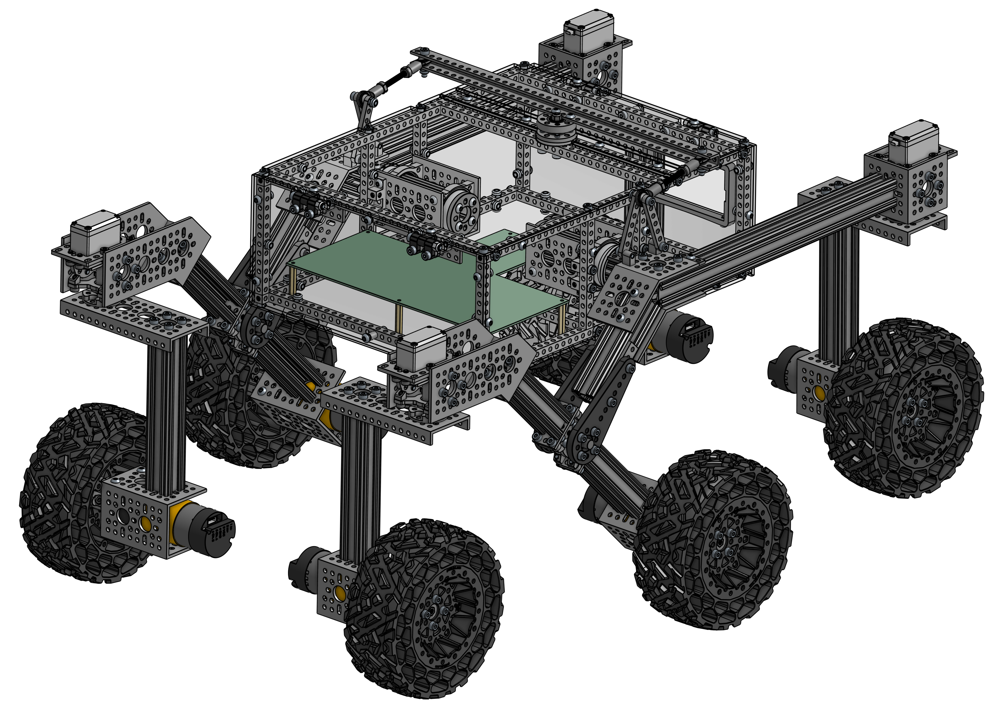

# Mechanical

</img>

## Assembly Guide

👉 [`Mechanical Assembly Guide`](./assembly_guide/readme.md)

## Required Parts

This is a summary of all the mechanical parts you need to build the rover. The amount is always the number of the `individual parts`. Some parts are sold in `(packs)`. The number in brackets indicates, how many packs you need.

> ⚠️ Be very careful when ordering the parts! Many parts have multiple variants, some with very small differences. It is important that you get the exact parts listed!

#### goBILDA Parts

| Amount | Part                                                                                                                             | Part Number    | Link                                                                                                                                  | Chapter                         |
| :----: | -------------------------------------------------------------------------------------------------------------------------------- | -------------- | ------------------------------------------------------------------------------------------------------------------------------------- | ------------------------------- |
|   1    | 1101 Series U-Beam (**41 Hole**, 328mm Length)                                                                                   | 1101-0041-0328 | https://www.gobilda.com/1101-series-u-beam-41-hole-328mm-length/                                                                      | Main Body                       |
| 8 (4)  | 1102 Series Flat Beam (**3 Hole**, 24mm Length) - 2 Pack                                                                         | 1102-0003-0024 | https://www.gobilda.com/1102-series-flat-beam-3-hole-24mm-length-2-pack/                                                              | Rocker Bogie                    |
| 4 (2)  | 1102 Series Flat Beam (**7 Hole**, 56mm Length) - 2 Pack                                                                         | 1102-0007-0056 | https://www.gobilda.com/1102-series-flat-beam-7-hole-56mm-length-2-pack/                                                              | Rocker Bogie                    |
|   8    | 1106 Series Square Beam (**12 Hole**, 96mm Length)                                                                               | 1106-0012-0096 | https://www.gobilda.com/1106-series-square-beam-12-hole-96mm-length/                                                                  | Main Body                       |
|   7    | 1106 Series Square Beam (**29 Hole**, 232mm Length)                                                                              | 1106-0029-0232 | https://www.gobilda.com/1106-series-square-beam-29-hole-232mm-length/                                                                 | Main Body                       |
|   4    | 1106 Series Square Beam (**41 Hole**, 328mm Length)                                                                              | 1106-0041-0328 | https://www.gobilda.com/1106-series-square-beam-41-hole-328mm-length/                                                                 | Main Body                       |
|   4    | 1109 Series goRAIL (**144mm Length**)                                                                                            | 1109-0024-0144 | https://www.gobilda.com/1109-series-gorail-144mm-length/                                                                              | Wheels                          |
|   4    | 1111 Series Angle Pattern Bracket (**1-1**)                                                                                      | 1111-0001-0001 | https://www.gobilda.com/1111-series-angle-pattern-bracket-1-1/                                                                        | Rocker Bogie                    |
|   2    | 1111 Series Angle Pattern Bracket (**3-1**)                                                                                      | 1111-0003-0001 | https://www.gobilda.com/1111-series-angle-pattern-bracket-3-1/                                                                        | Rocker Bogie                    |
| 4 (2)  | 1114 Series Flat Bracket (**1-1**) - 2 Pack                                                                                      | 1114-0001-0001 | https://www.gobilda.com/1114-series-flat-bracket-1-1-2-pack/                                                                          | Rocker Bogie                    |
|   8    | 1116 Series Grid Plate (**3 x 5 Hole**, 24 x 40mm)                                                                               | 1116-0024-0040 | https://www.gobilda.com/1116-series-grid-plate-3-x-5-hole-24-x-40mm/                                                                  | Main Body, Wheels, Rocker Bogie |
|   6    | 1118 Series Open goRAIL (**96mm Length**)                                                                                        | 1118-0024-0096 | https://www.gobilda.com/1118-series-open-gorail-96mm-length/                                                                          | Wheels, Rocker Bogie            |
|   2    | 1118 Series Open goRAIL (**120mm Length**)                                                                                       | 1118-0024-0120 | https://www.gobilda.com/1118-series-open-gorail-120mm-length/                                                                         | Rocker Bogie                    |
|   2    | 1118 Series Open goRAIL (**288mm Length**)                                                                                       | 1118-0024-0288 | https://www.gobilda.com/1118-series-open-gorail-288mm-length/                                                                         | Rocker Bogie                    |
|   2    | 1120 Series U-Channel (**1 Hole**, 48mm Length)                                                                                  | 1120-0001-0048 | https://www.gobilda.com/1120-series-u-channel-1-hole-48mm-length/                                                                     | Rocker Bogie                    |
|   8    | 1120 Series U-Channel (**2 Hole**, 72mm Length)                                                                                  | 1120-0002-0072 | https://www.gobilda.com/1120-series-u-channel-2-hole-72mm-length/                                                                     | Main Body, Wheels               |
|   4    | 1121 Series Low-Side U-Channel (**4 Hole**, 120mm Length)                                                                        | 1121-0004-0120 | https://www.gobilda.com/1121-series-low-side-u-channel-4-hole-120mm-length/                                                           | Wheels                          |
| 2 (1)  | 1137 Series Steel Flat Grid Bracket (1-1) - 2 Pack                                                                               | 1137-0001-0001 | https://www.gobilda.com/1137-series-steel-flat-grid-bracket-1-1-2-pack/                                                               | Rocker Bogie                    |
| 4 (1)  | 1203 Series Block Mount (1-1) - 4 Pack                                                                                           | 1203-0001-0001 | https://www.gobilda.com/1203-series-block-mount-1-1-4-pack/                                                                           | Rocker Bogie                    |
| 4 (2)  | 1205 Series Dual Block Mount (1-4) - 2 Pack                                                                                      | 1205-0001-0004 | https://www.gobilda.com/1205-series-dual-block-mount-1-4-2-pack/                                                                      | Main Body                       |
|   4    | 1221 Series 2-Side, 2-Post Pattern Mount (**32-2**)                                                                              | 1221-0032-0002 | https://www.gobilda.com/1221-series-2-side-2-post-pattern-mount-32-2/                                                                 | Rocker Bogie                    |
|   2    | 1309 Series Sonic Hub (**8mm Bore**)                                                                                             | 1309-0016-0008 | https://www.gobilda.com/1309-series-sonic-hub-8mm-bore/                                                                               | Rocker Bogie                    |
|   6    | 1310 Series Hyper Hub (**8mm REX™** Bore)                                                                                        | 1310-0016-4008 | https://www.gobilda.com/1310-series-hyper-hub-8mm-rex-bore/                                                                           | Wheels                          |
|   6    | 1401 Series 2-Side, 2-Post Clamping Mount (**43mm Width**, **36mm Bore**)                                                        | 1401-0043-0036 | https://www.gobilda.com/1401-series-2-side-2-post-clamping-mount-43mm-width-36mm-bore/                                                | Wheels                          |
| 4 (1)  | 1501 Series M4 x 0.7mm Standoff (**6mm OD**, **8mm Length**) - 4 Pack                                                            | 1501-0006-0080 | https://www.gobilda.com/1501-series-m4-x-0-7mm-standoff-6mm-od-8mm-length-4-pack/                                                     | Main Body                       |
| 8 (2)  | 1501 Series M4 x 0.7mm Standoff (**6mm OD**, **22mm Length**) - 4 Pack                                                           | 1501-0006-0220 | https://www.gobilda.com/1501-series-m4-x-0-7mm-standoff-6mm-od-22mm-length-4-pack/                                                    | Main Body                       |
|   4    | 1504 Series **32mm OD** Pattern Spacer (**2mm Length**)                                                                          | 1504-0032-0020 | https://www.gobilda.com/1504-series-32mm-od-pattern-spacer-2mm-length/                                                                | Rocker Bogie                    |
| 6 (3)  | 1506 Series 32mm ID Spacer (36mm OD, **6mm Length**) - 2 Pack                                                                    | 1506-0032-0006 | https://www.gobilda.com/1506-series-32mm-id-spacer-36mm-od-6mm-length-2-pack/                                                         | Rocker Bogie, Final Steps       |
| 2 (1)  | goTUBE Endcap (14mm Bore, 36mm OD, 4mm Thick) - 4 Pack                                                                           | 1519-0014-0400 | https://www.gobilda.com/gotube-endcap-14mm-bore-36mm-od-4mm-thick-4-pack/                                                             | Final Steps                     |
| 2 (1)  | 1522 Series 8mm ID Spacer (10mm OD, **4mm Length**) - 4 Pack                                                                     | 1522-0010-0040 | https://www.gobilda.com/1522-series-8mm-id-spacer-10mm-od-4mm-length-4-pack/                                                          | Rocker Bogie                    |
| 2 (1)  | 1522 Series 8mm ID Spacer (10mm OD, **6mm Length**) - 4 Pack                                                                     | 1522-0010-0060 | https://www.gobilda.com/1522-series-8mm-id-spacer-10mm-od-6mm-length-4-pack/                                                          | Rocker Bogie                    |
|   4    | **32mm** Bore 2-Side, 2-Post Pillow Block (**43mm Width**)                                                                       | 1604-0043-0032 | https://www.gobilda.com/32mm-bore-2-side-2-post-pillow-block-43mm-width/                                                              | Main Body                       |
|   1    | Idler Bearing-Hub (**32mm OD**, **16mm Height**)                                                                                 | 1608-0001-0001 | https://www.gobilda.com/idler-bearing-hub-32mm-od-16mm-height/                                                                        | Main Body                       |
| 4 (2)  | 1611 Series Flanged Ball Bearing (**8mm ID** x **14mm OD**, **5mm Thickness**) - 2 Pack                                          | 1611-0514-0008 | https://www.gobilda.com/1611-series-flanged-ball-bearing-8mm-id-x-14mm-od-5mm-thickness-2-pack/                                       | Rocker Bogie                    |
|   4    | Plastic Hub-Mount Control Arm (**72mm Length**)                                                                                  | 1916-0014-0072 | https://www.gobilda.com/plastic-hub-mount-control-arm-72mm-length/                                                                    | Rocker Bogie                    |
|   4    | 2000 Series Dual Mode Servo (**25-2**, **Torque**)                                                                               | 2000-0025-0002 | https://www.gobilda.com/2000-series-dual-mode-servo-25-2-torque/                                                                      | Rocker Bogie                    |
|   2    | **8mm** Shaft (Stainless Steel, **50mm Length**)                                                                                 | 2100-0008-0050 | https://www.gobilda.com/8mm-shaft-stainless-steel-50mm-length/                                                                        | Rocker Bogie                    |
| 32 (2) | Hurricane Nut for goRAIL - 25 Pack                                                                                               | 2805-0004-0108 | https://www.gobilda.com/hurricane-nut-for-gorail-25-pack/                                                                             | Rocker Bogie                    |
| 2 (1)  | 2808 Series Stainless Steel Threaded Rod (M4 x 0.7mm, **50mm Length**) - 2 Pack                                                  | 2808-0004-0050 | https://www.gobilda.com/2808-series-stainless-steel-threaded-rod-m4-x-0-7mm-50mm-length-2-pack/                                       | Rocker Bogie                    |
| 4 (2)  | Plastic Hinge - 2 Pack                                                                                                           | 2902-0003-0001 | https://www.gobilda.com/plastic-hinge-2-pack/                                                                                         | Main Body                       |
| 4 (2)  | 2913 Series Steel Ball Linkage (**Female** M4 x 0.7mm, 24.1mm Length) - 2 Pack                                                   | 2913-0004-0241 | https://www.gobilda.com/2913-series-steel-ball-linkage-female-m4-x-0-7mm-24-1mm-length-2-pack/                                        | Rocker Bogie                    |
|   4    | ServoBlock® (Standard Size, 25 Tooth Spline, Hub-Shaft)                                                                          | 3202-0001-2501 | https://www.gobilda.com/servoblock-standard-size-25-tooth-spline-hub-shaft/                                                           | Rocker Bogie                    |
|   6    | Wasteland Wheel (**144mm Diameter**, **52mm Width**)                                                                             | 3616-0014-0144 | https://www.gobilda.com/wasteland-wheel-144mm-diameter-52mm-width/                                                                    | Wheels                          |
|   6    | 5203 Series Yellow Jacket Planetary Gear Motor (26.9:1 Ratio, **24mm Length** **8mm REX™** Shaft, **223 RPM**, 3.3 - 5V Encoder) | 5203-2402-0027 | https://www.gobilda.com/5203-series-yellow-jacket-planetary-gear-motor-26-9-1-ratio-24mm-length-8mm-rex-shaft-223-rpm-3-3-5v-encoder/ | Wheels                          |
| 55 (3) | `M4` x 0.7mm Nylock Nut - 25 Pack                                                                                                | 2812-0004-0007 | https://www.gobilda.com/m4-x-0-7mm-nylock-nut/?sku=2812-0004-0007                                                                     |                                 |

#### Generic Parts

| Amount | Part                          |
| :----: | ----------------------------- |
|   72   | `M4 x 6mm` Button Head Screw  |
|   44   | `M4 x 10mm` Button Head Screw |
|   39   | `M4 x 16mm` Button Head Screw |
|   74   | `M4 x 8mm` Socket Head Screw  |
|  120   | `M4 x 12mm` Socket Head Screw |
|   50   | `M4 x 16mm` Socket Head Screw |
|   4    | `M4 x 20mm` Socket Head Screw |
|   32   | `M4 x 0.1mm` Washer           |

#### Lasercut Parts

| Amount | Part            | File                                                         |
| :----: | --------------- | ------------------------------------------------------------ |
|   1    | Bottom Plate    | [bottom_plate.dxf](./laser_cut_parts/bottom_plate.dxf)       |
|   2    | Side Plate      | [side_plate.dxf](./laser_cut_parts/side_plate.dxf)           |
|   1    | Front Plate     | [front_plate.dxf](./laser_cut_parts/front_plate.dxf)         |
|   1    | Back Plate      | [back_plate.dxf](./laser_cut_parts/back_plate.dxf)           |
|   1    | Top Plate Front | [top_plate_front.dxf](./laser_cut_parts/top_plate_front.dxf) |
|   1    | Top Plate Gap   | [top_plate_gap.dxf](./laser_cut_parts/top_plate_gap.dxf)     |
|   1    | Top Plate Back  | [top_plate_back.dxf](./laser_cut_parts/top_plate_back.dxf)   |
