# Mechanical Assembly Guide

## 1 Main Body

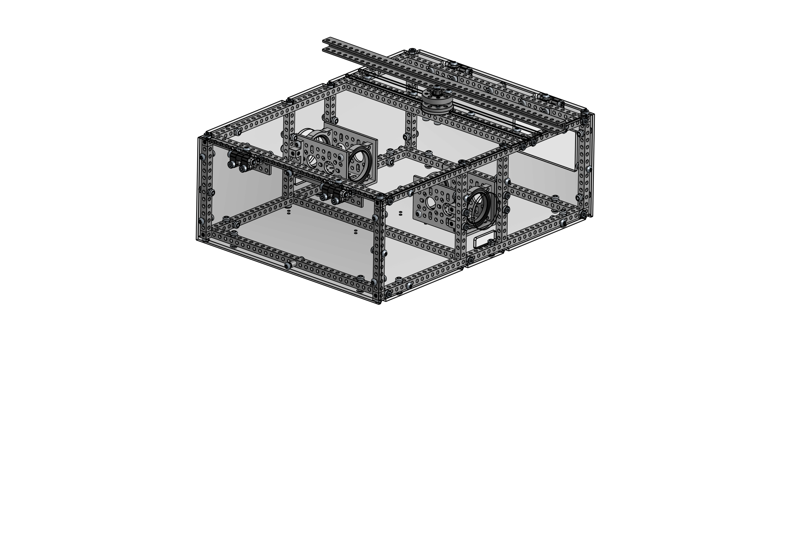

#### Assembly Steps

- 1.1 [Aluminum Frame](#11-aluminum-frame)
- 1.2 [Wall Standoffs](#12-wall-standoffs)
- 1.3 [Axis Clamps (2x)](#13-axis-clamps-2x)
- 1.4 [Axis Clamp Installation](#14-axis-clamp-installation)
- 1.5 [Top Plate Hinges (4x)](#15-top-plate-hinges-4x)
- 1.6 [Top Plate Hinge Installation](#16-top-plate-hinge-installation)
- 1.7 [Bottom Plate](#17-bottom-plate)
- 1.8 [Side Plates](#18-side-plates)
- 1.9 [Front and Back Plates](#19-front-and-back-plates)
- 1.10 [Top Plates](#110-top-plates)
- 1.11 [Differential Pivot](#111-differential-pivot)
- [Required Parts (Main Body)](#required-parts-main-body)

### 1.1 Aluminum Frame

#### Required Parts

| Amount | Part                                                | Part Number    | Link                                                                  |
| :----: | --------------------------------------------------- | -------------- | --------------------------------------------------------------------- |
|   4    | 1106 Series Square Beam (**41 Hole**, 328mm Length) | 1106-0041-0328 | https://www.gobilda.com/1106-series-square-beam-41-hole-328mm-length/ |
|   7    | 1106 Series Square Beam (**29 Hole**, 232mm Length) | 1106-0029-0232 | https://www.gobilda.com/1106-series-square-beam-29-hole-232mm-length/ |
|   8    | 1106 Series Square Beam (**12 Hole**, 96mm Length)  | 1106-0012-0096 | https://www.gobilda.com/1106-series-square-beam-12-hole-96mm-length/  |
|   30   | `M4 x 16mm` Socket Head Screw                       |                |                                                                       |

#### Assembly Info

Top beam mounting positions: `2` `28` `30` `40`  
Bottom beam mounting positions: `2` `18` `40`  
Vertical beam positions: `1` `17` `25` `41`

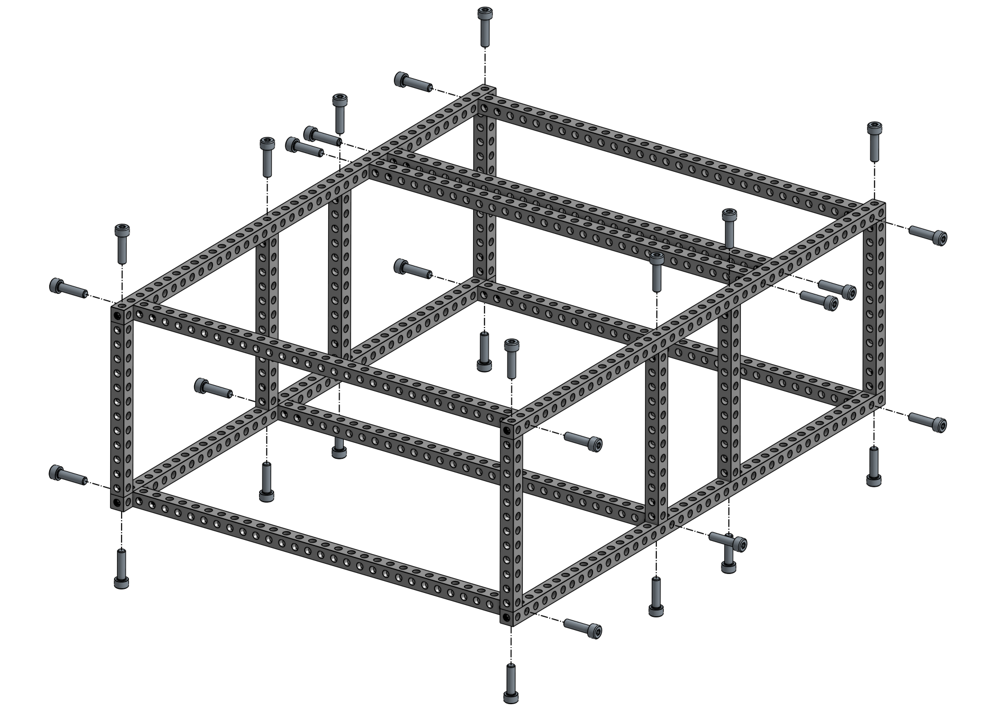 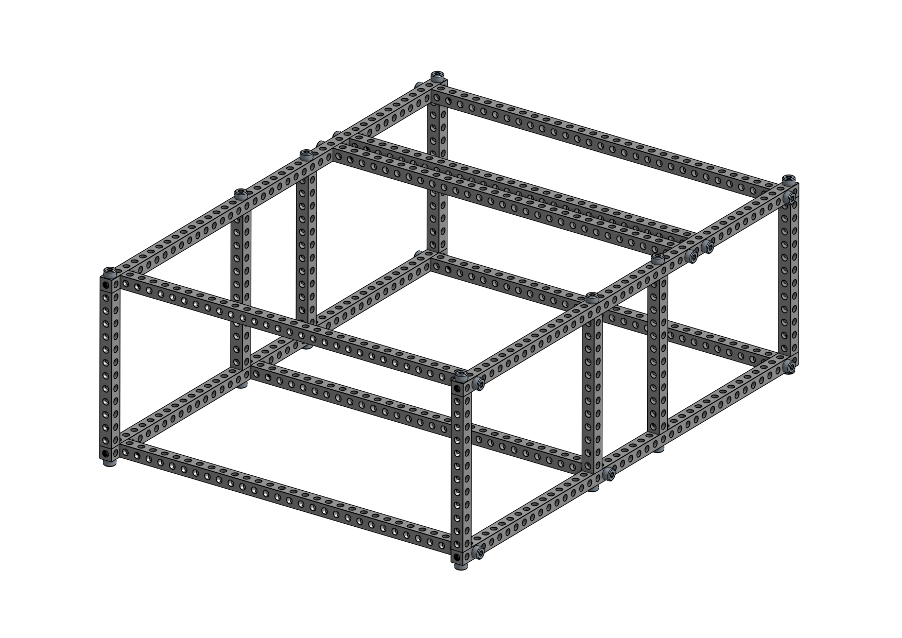

### 1.2 Wall Standoffs

#### Required Parts

| Amount | Part                                                                  | Part Number    | Link                                                                              |
| :----: | --------------------------------------------------------------------- | -------------- | --------------------------------------------------------------------------------- |
| 4 (1)  | 1501 Series M4 x 0.7mm Standoff (**6mm OD**, **8mm Length**) - 4 Pack | 1501-0006-0080 | https://www.gobilda.com/1501-series-m4-x-0-7mm-standoff-6mm-od-8mm-length-4-pack/ |
|   4    | `M4 x 12mm` Socket Head Screw                                         |                |                                                                                   |

#### Assembly Info

Standoff mounting position: `15` (center of 29 hole beam)

 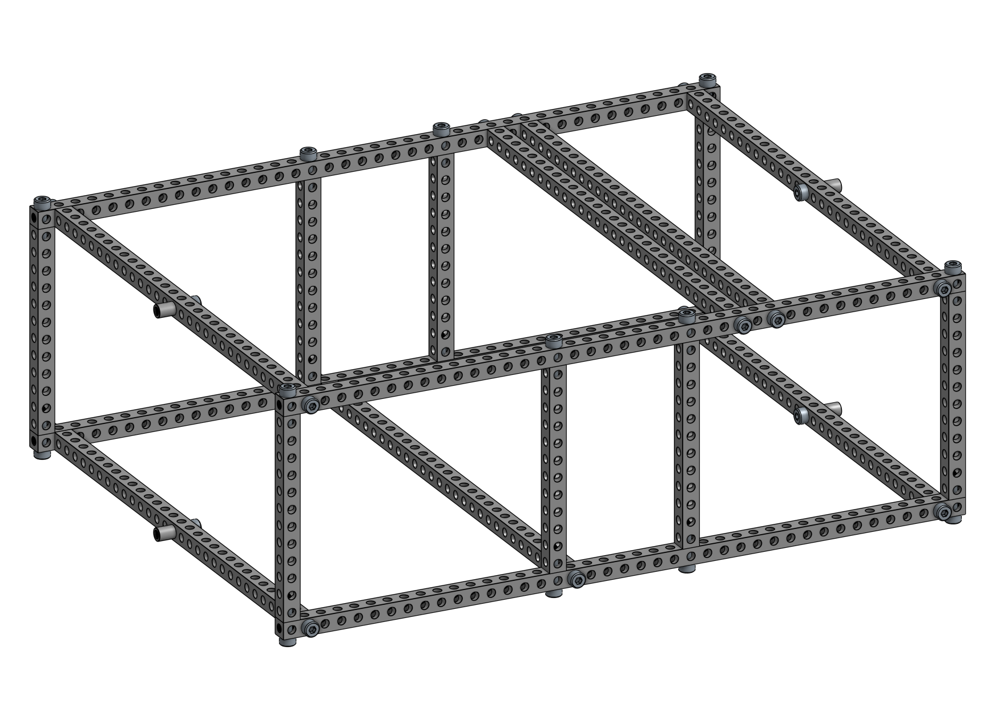

### 1.3 Axis Clamps (2x)

#### Required Parts

| Amount | Part                                                       | Part Number    | Link                                                                     |
| :----: | ---------------------------------------------------------- | -------------- | ------------------------------------------------------------------------ |
|   2    | 1120 Series U-Channel (**2 Hole**, 72mm Length)            | 1120-0002-0072 | https://www.gobilda.com/1120-series-u-channel-2-hole-72mm-length/        |
| 4 (2)  | 1205 Series Dual Block Mount (1-4) - 2 Pack                | 1205-0001-0004 | https://www.gobilda.com/1205-series-dual-block-mount-1-4-2-pack/         |
|   4    | **32mm** Bore 2-Side, 2-Post Pillow Block (**43mm Width**) | 1604-0043-0032 | https://www.gobilda.com/32mm-bore-2-side-2-post-pillow-block-43mm-width/ |
|   8    | `M4 x 6mm` Button Head Screw                               |                |                                                                          |
|   8    | `M4 x 10mm` Button Head Screw                              |                |                                                                          |

#### Assembly Info

> ⚠️ Pay attention to the orientation of the _Pillow Blocks_! The flush sides should face outwards.  
> ⚠️ Pay attention to the orientation of the _Dual Block Mounts_! They should be as near to the edge of the _U-Channel_ as possible.

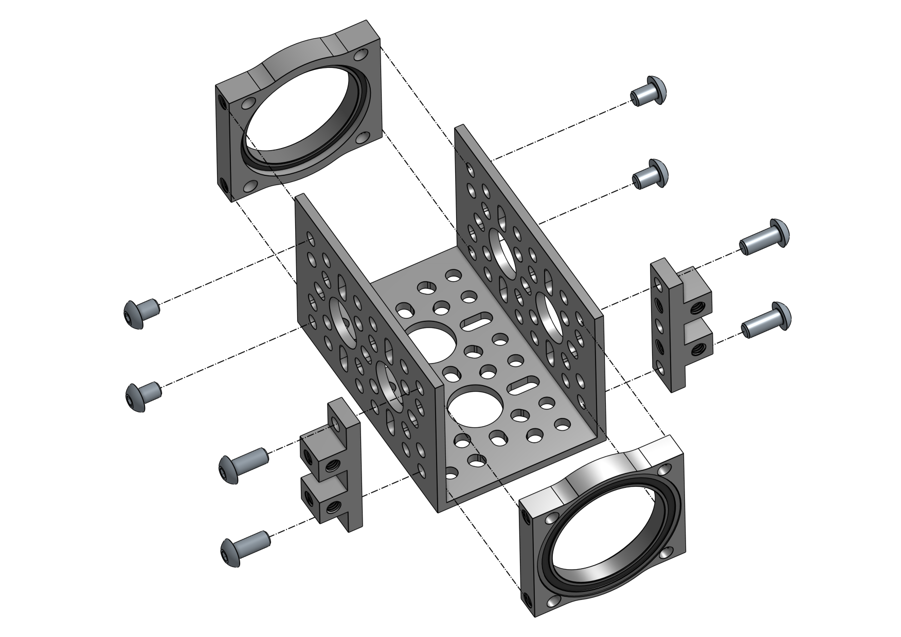 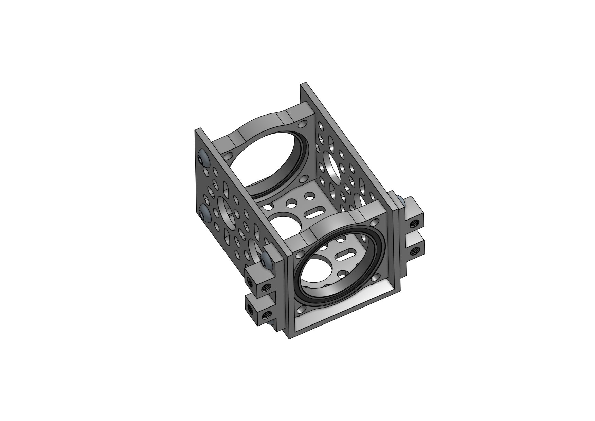

### 1.4 Axis Clamp Installation

| Amount | Part                             | Part Number | Link |
| :----: | -------------------------------- | ----------- | ---- |
|   2    | [Axis Clamp](#13-axis-clamps-2x) |             |      |
|   8    | `M4 x 16mm` Socket Head Screw    |             |      |

Axis clamp mounting position: `5` `7` (counting from the bottom)

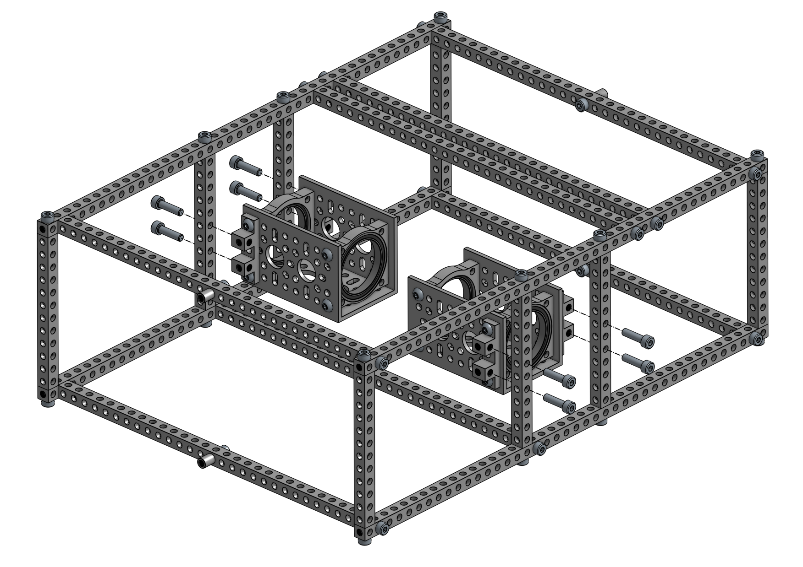 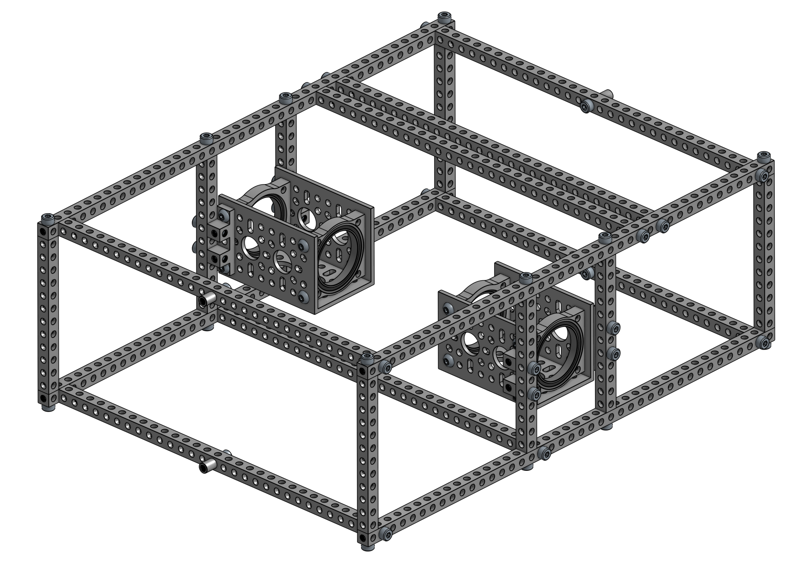

### 1.5 Top Plate Hinges (4x)

#### Required Parts

| Amount | Part                                                                   | Part Number    | Link                                                                               |
| :----: | ---------------------------------------------------------------------- | -------------- | ---------------------------------------------------------------------------------- |
| 4 (2)  | Plastic Hinge - 2 Pack                                                 | 2902-0003-0001 | https://www.gobilda.com/plastic-hinge-2-pack/                                      |
| 8 (2)  | 1501 Series M4 x 0.7mm Standoff (**6mm OD**, **22mm Length**) - 4 Pack | 1501-0006-0220 | https://www.gobilda.com/1501-series-m4-x-0-7mm-standoff-6mm-od-22mm-length-4-pack/ |
|   4    | 1116 Series Grid Plate (**3 x 5 Hole**, 24 x 40mm)                     | 1116-0024-0040 | https://www.gobilda.com/1116-series-grid-plate-3-x-5-hole-24-x-40mm/               |
|   16   | `M4 x 12mm` Socket Head Screw                                          |                |                                                                                    |

#### Assembly Info

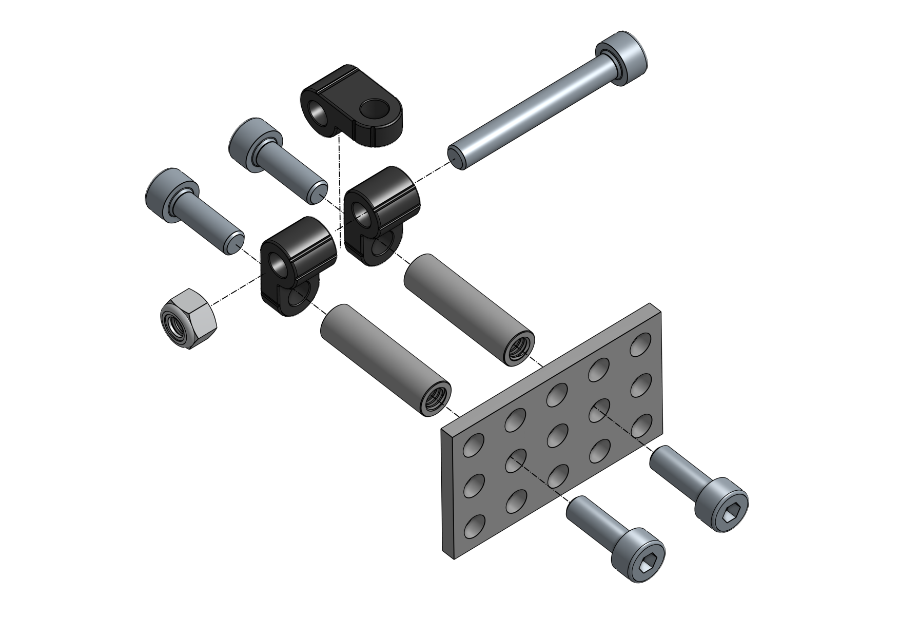 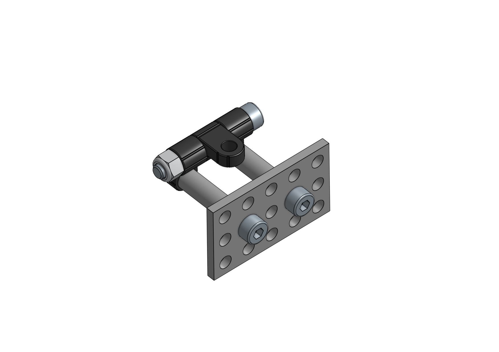

### 1.6 Top Plate Hinge Installation

#### Required Parts

| Amount | Part                                       | Part Number | Link |
| :----: | ------------------------------------------ | ----------- | ---- |
|   4    | [Top Plate Hinge](#15-top-plate-hinges-4x) |             |      |
|   8    | `M4 x 16mm` Socket Head Screw              |             |      |
|   8    | `M4` Nylock Nut                            |             |      |

#### Assembly Info

Mounting positions on 29 hole beam: `5` `9` (counting from each edge). The plastic hinge should point up and be flush with the top of the aluminum frame.

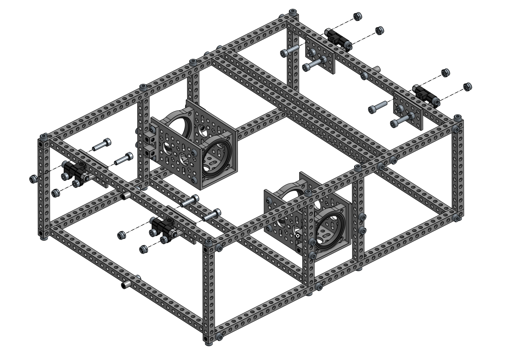 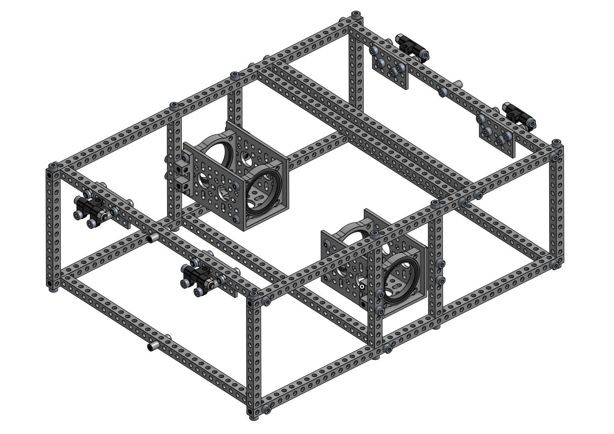

### 1.7 Bottom Plate

#### Required Parts

| Amount | Part                          | Part Number      | Link |
| :----: | ----------------------------- | ---------------- | ---- |
|   1    | Bottom Plate (lasercut)       | bottom_plate.dxf |      |
|   11   | `M4 x 16mm` Button Head Screw |                  |      |
|   11   | `M4` Nylock Nut               |                  |      |

#### Assembly Info

> 🔃 The 3D model is upside down in the following image!

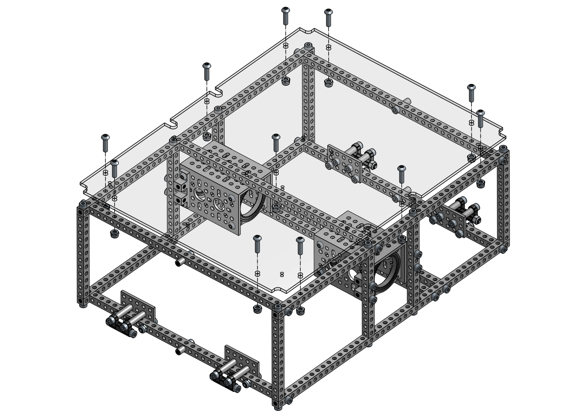 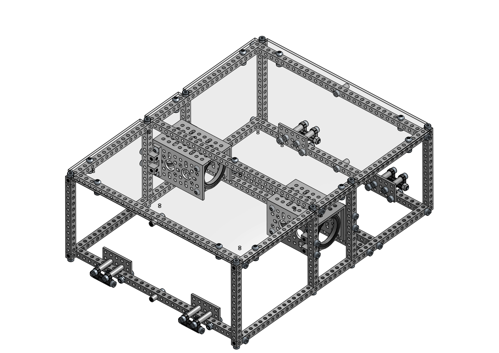

### 1.8 Side Plates

#### Required Parts

| Amount | Part                          | Part Number    | Link |
| :----: | ----------------------------- | -------------- | ---- |
|   2    | Side Plate (lasercut)         | side_plate.dxf |      |
|   16   | `M4 x 16mm` Button Head Screw |                |      |
|   16   | `M4` Nylock Nut               |                |      |

#### Assembly Info

> 🔃 The 3D model is upside down in the following image!

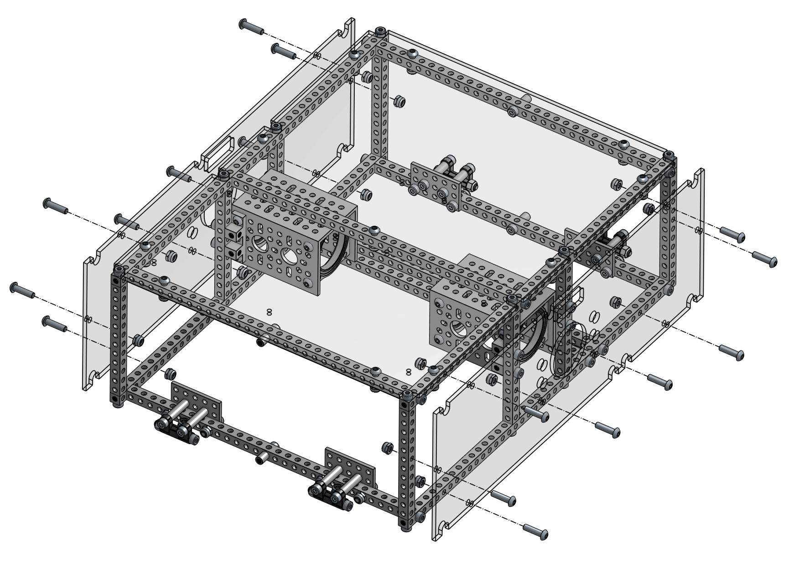 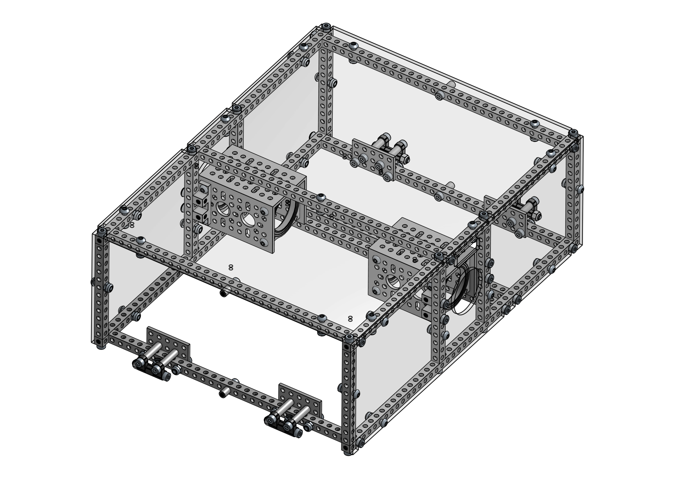

### 1.9 Front and Back Plates

#### Required Parts

| Amount | Part                          | Part Number     | Link |
| :----: | ----------------------------- | --------------- | ---- |
|   1    | Front Plate (lasercut)        | front_plate.dxf |      |
|   1    | Back Plate (lasercut)         | back_plate.dxf  |      |
|   4    | `M4 x 6mm` Button Head Screw  |                 |      |
|   8    | `M4 x 16mm` Button Head Screw |                 |      |
|   8    | `M4` Nylock Nut               |                 |      |

#### Assembly Info

> ⚠️ Pay attention to the orientation of the _Back Plate_!

Use 6mm screws to secure the plates to the standoffs.

> 🔃 The 3D model is upside down in the following image!

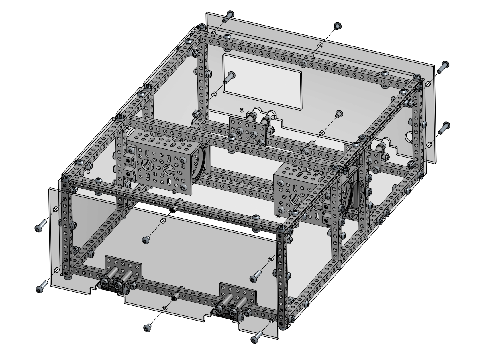 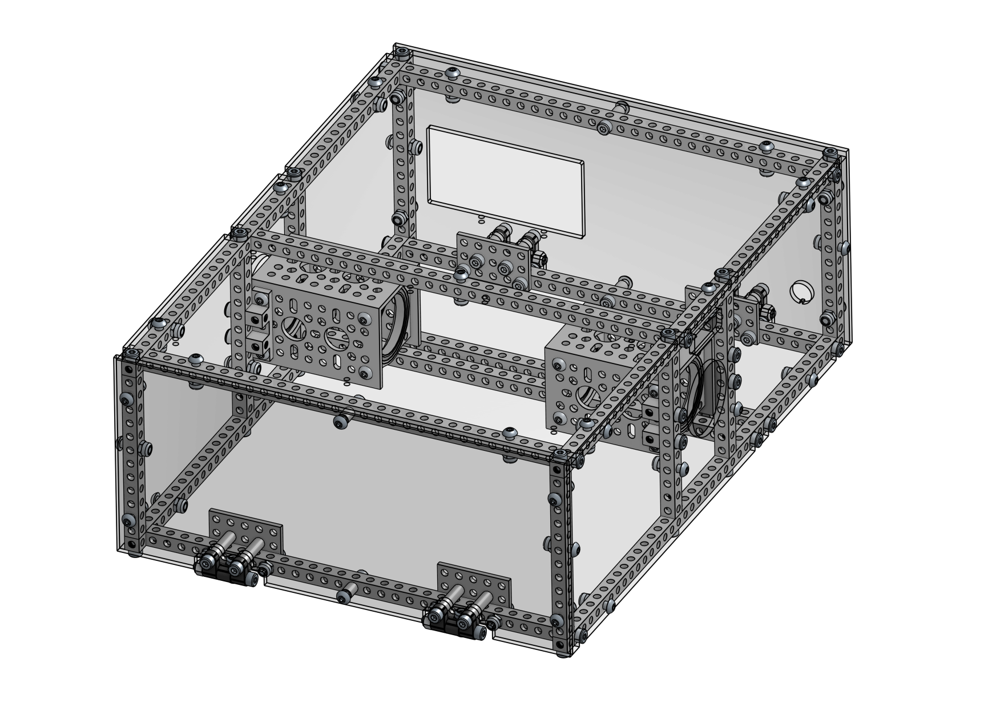

### 1.10 Top Plates

#### Required Parts

| Amount | Part                          | Part Number         | Link |
| :----: | ----------------------------- | ------------------- | ---- |
|   1    | Top Plate Front (lasercut)    | top_plate_front.dxf |      |
|   1    | Top Plate Gap (lasercut)      | top_plate_gap.dxf   |      |
|   1    | Top Plate Back (lasercut)     | top_plate_back.dxf  |      |
|   4    | `M4 x 10mm` Button Head Screw |                     |      |
|   4    | `M4 x 16mm` Button Head Screw |                     |      |
|   8    | `M4` Nylock Nut               |                     |      |

#### Assembly Info

Use the 10mm screws to secure the front and back top plates to the plastic hinges. Use the 16mm screws to mount the gap plate to the square beam between the other top plates.

> 💡 Tighten or loosen the screw inside the hinges to adjust the hinge tension. The top plates should open smoothly and stay in place when opened.

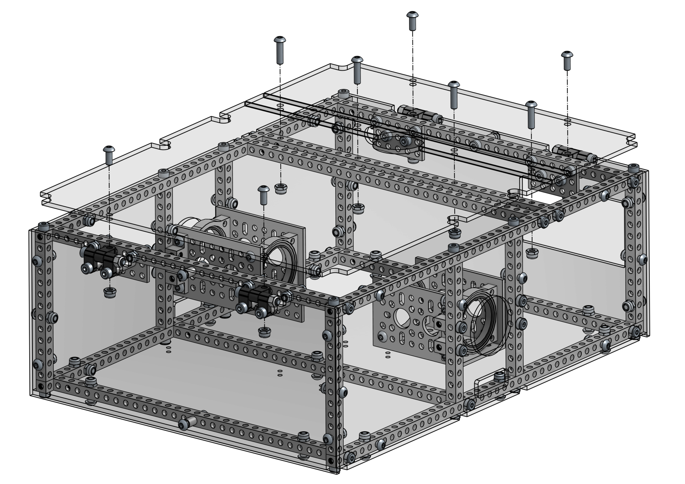 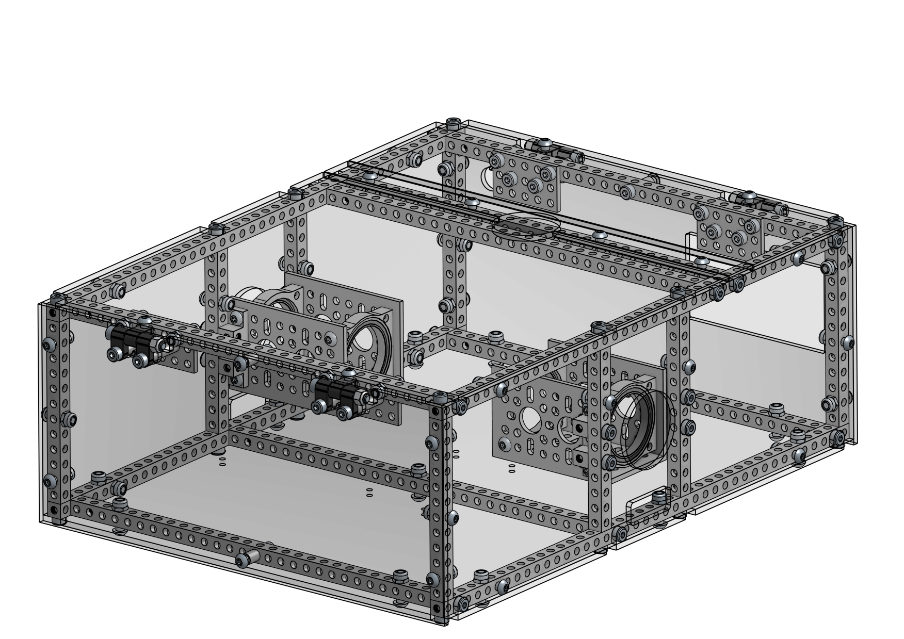

### 1.11 Differential Pivot

#### Required Parts

| Amount | Part                                             | Part Number    | Link                                                             |
| :----: | ------------------------------------------------ | -------------- | ---------------------------------------------------------------- |
|   1    | Idler Bearing-Hub (**32mm OD**, **16mm Height**) | 1608-0001-0001 | https://www.gobilda.com/idler-bearing-hub-32mm-od-16mm-height/   |
|   1    | 1101 Series U-Beam (**41 Hole**, 328mm Length)   | 1101-0041-0328 | https://www.gobilda.com/1101-series-u-beam-41-hole-328mm-length/ |
|   2    | `M4 x 6mm` Button Head Screw                     |                |                                                                  |
|   4    | `M4 x 16mm` Socket Head Screw                    |                |                                                                  |

#### Assembly Info

Secure the _U-Beam_ to the _Idler Bearing-Hub_ using the 6mm button head screws. Slide them into the _U-Beam_ through hole `20` and `22` and use an allen key to tighten them. Then mount the _Idler Bearing-Hub_ to the aluminum frame using the 16mm socket head screws.

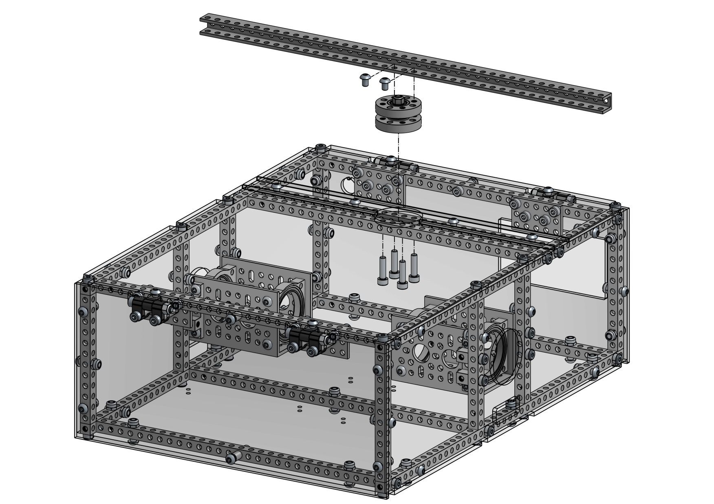 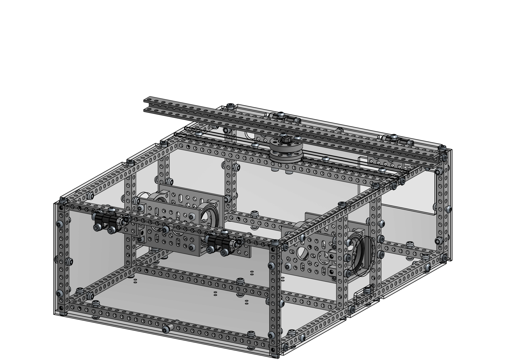

### Next Steps

> 🎉 Congratulations on completing the main body assembly!

- [x] 1 Main Body
- [ ] [2 Wheels](2_wheels.md)
- [ ] [3 Rocker Bogie](3_rocker_bogie.md)
- [ ] [4 Final Steps](4_final_steps.md)

Continue with building the [Wheels](2_wheels.md)!

### Required Parts (Main Body)

This is a summary of all parts required in this chapter.

| Amount | Part                                                                   | Part Number         | Link                                                                               |
| :----: | ---------------------------------------------------------------------- | ------------------- | ---------------------------------------------------------------------------------- |
|   1    | 1101 Series U-Beam (**41 Hole**, 328mm Length)                         | 1101-0041-0328      | https://www.gobilda.com/1101-series-u-beam-41-hole-328mm-length/                   |
|   8    | 1106 Series Square Beam (**12 Hole**, 96mm Length)                     | 1106-0012-0096      | https://www.gobilda.com/1106-series-square-beam-12-hole-96mm-length/               |
|   7    | 1106 Series Square Beam (**29 Hole**, 232mm Length)                    | 1106-0029-0232      | https://www.gobilda.com/1106-series-square-beam-29-hole-232mm-length/              |
|   4    | 1106 Series Square Beam (**41 Hole**, 328mm Length)                    | 1106-0041-0328      | https://www.gobilda.com/1106-series-square-beam-41-hole-328mm-length/              |
|   4    | 1116 Series Grid Plate (**3 x 5 Hole**, 24 x 40mm)                     | 1116-0024-0040      | https://www.gobilda.com/1116-series-grid-plate-3-x-5-hole-24-x-40mm/               |
|   2    | 1120 Series U-Channel (**2 Hole**, 72mm Length)                        | 1120-0002-0072      | https://www.gobilda.com/1120-series-u-channel-2-hole-72mm-length/                  |
| 4 (2)  | 1205 Series Dual Block Mount (1-4) - 2 Pack                            | 1205-0001-0004      | https://www.gobilda.com/1205-series-dual-block-mount-1-4-2-pack/                   |
| 4 (1)  | 1501 Series M4 x 0.7mm Standoff (**6mm OD**, **8mm Length**) - 4 Pack  | 1501-0006-0080      | https://www.gobilda.com/1501-series-m4-x-0-7mm-standoff-6mm-od-8mm-length-4-pack/  |
| 8 (2)  | 1501 Series M4 x 0.7mm Standoff (**6mm OD**, **22mm Length**) - 4 Pack | 1501-0006-0220      | https://www.gobilda.com/1501-series-m4-x-0-7mm-standoff-6mm-od-22mm-length-4-pack/ |
|   4    | **32mm** Bore 2-Side, 2-Post Pillow Block (**43mm Width**)             | 1604-0043-0032      | https://www.gobilda.com/32mm-bore-2-side-2-post-pillow-block-43mm-width/           |
|   1    | Idler Bearing-Hub (**32mm OD**, **16mm Height**)                       | 1608-0001-0001      | https://www.gobilda.com/idler-bearing-hub-32mm-od-16mm-height/                     |
| 4 (2)  | Plastic Hinge - 2 Pack                                                 | 2902-0003-0001      | https://www.gobilda.com/plastic-hinge-2-pack/                                      |
|   1    | Bottom Plate (lasercut)                                                | bottom_plate.dxf    |                                                                                    |
|   2    | Side Plate (lasercut)                                                  | side_plate.dxf      |                                                                                    |
|   1    | Front Plate (lasercut)                                                 | front_plate.dxf     |                                                                                    |
|   1    | Back Plate (lasercut)                                                  | back_plate.dxf      |                                                                                    |
|   1    | Top Plate Front (lasercut)                                             | top_plate_front.dxf |                                                                                    |
|   1    | Top Plate Gap (lasercut)                                               | top_plate_gap.dxf   |                                                                                    |
|   1    | Top Plate Back (lasercut)                                              | top_plate_back.dxf  |                                                                                    |
|   14   | `M4 x 6mm` Button Head Screw                                           |                     |                                                                                    |
|   12   | `M4 x 10mm` Button Head Screw                                          |                     |                                                                                    |
|   39   | `M4 x 16mm` Button Head Screw                                          |                     |                                                                                    |
|   20   | `M4 x 12mm` Socket Head Screw                                          |                     |                                                                                    |
|   50   | `M4 x 16mm` Socket Head Screw                                          |                     |                                                                                    |
|   51   | `M4` Nylock Nut                                                        |                     |                                                                                    |
