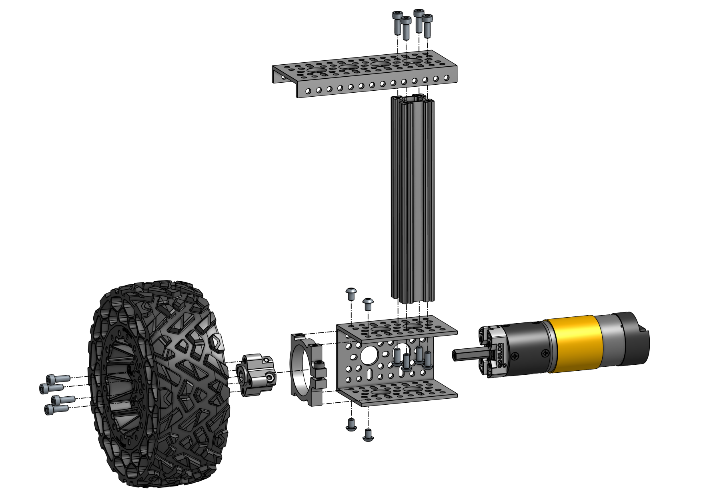
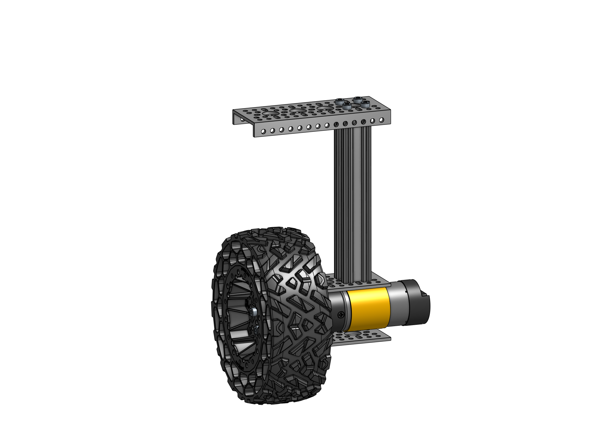
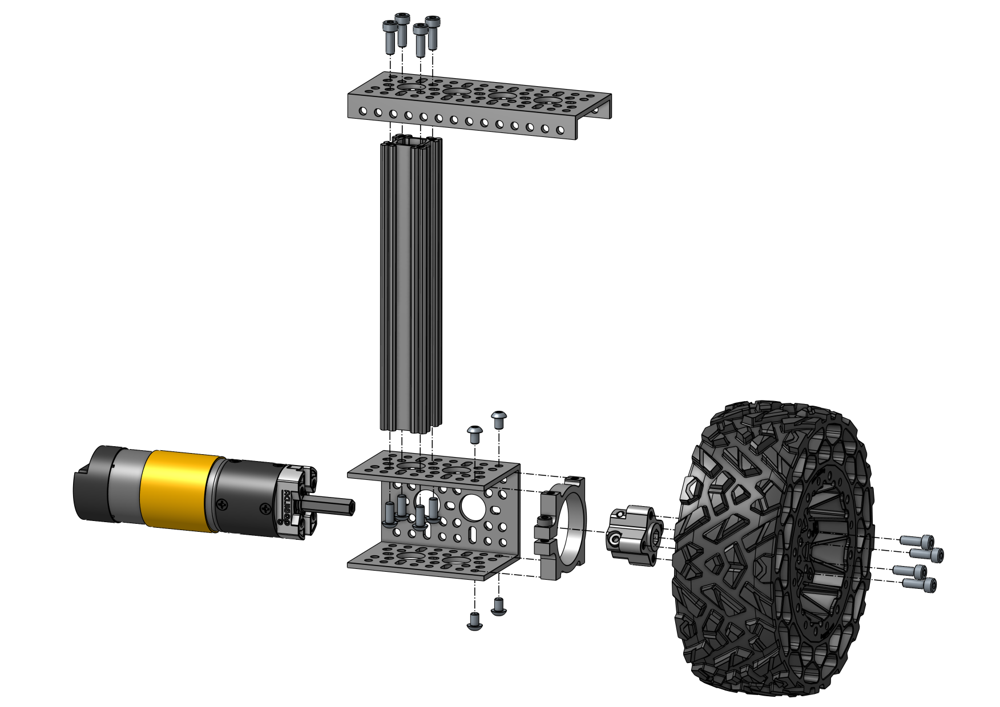
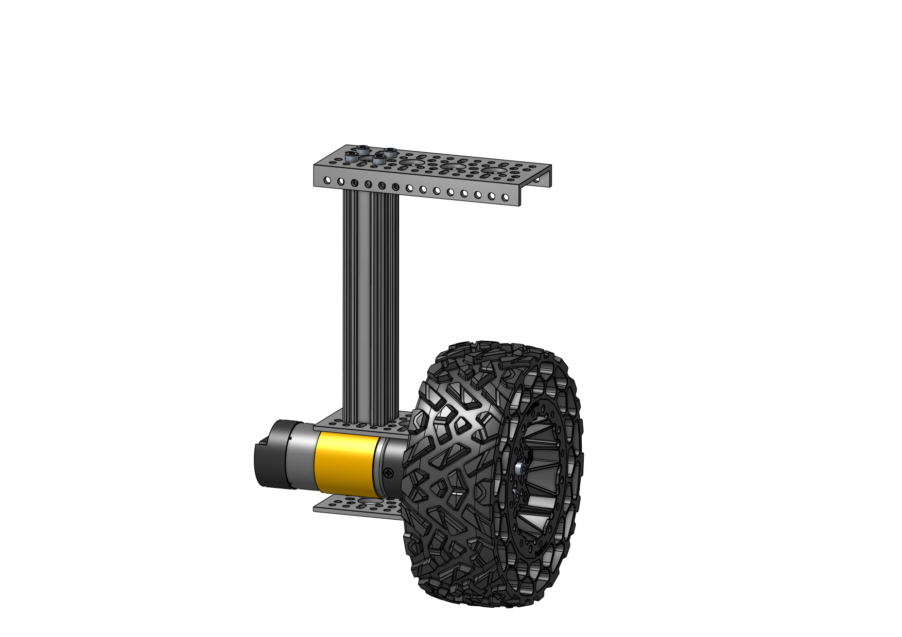
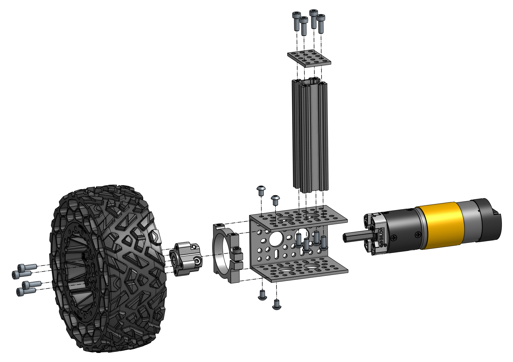
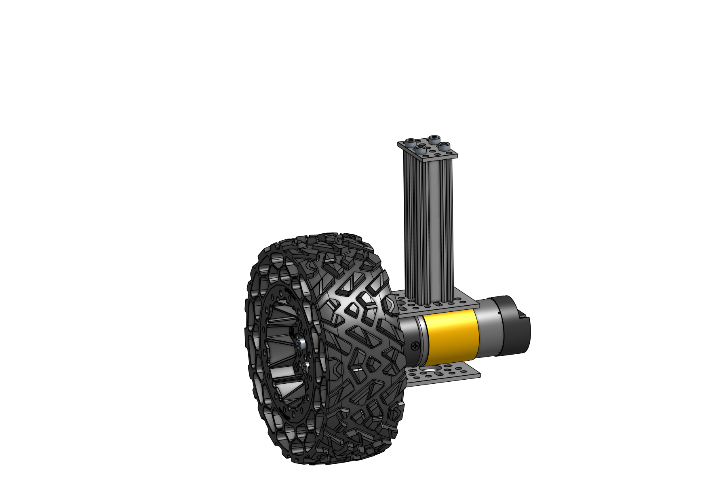
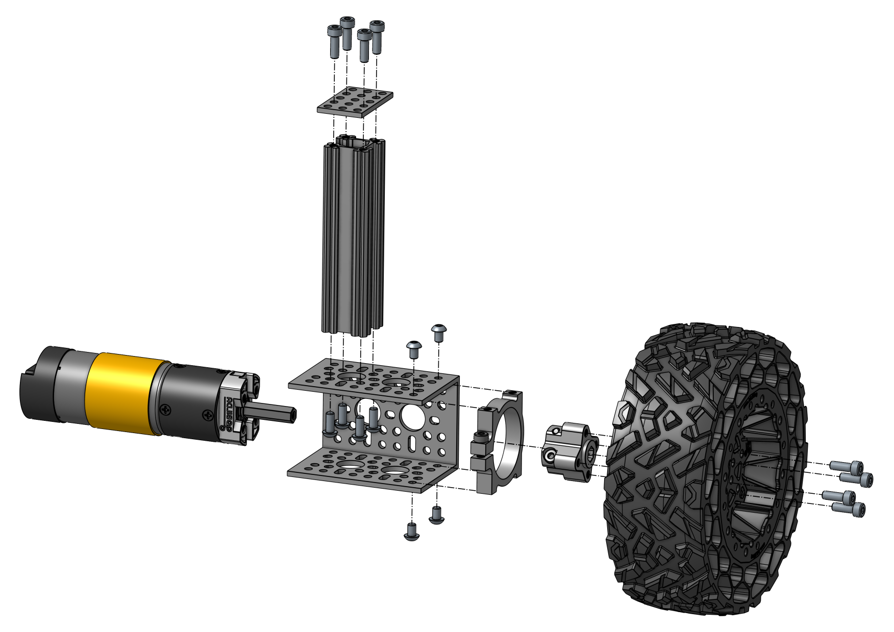
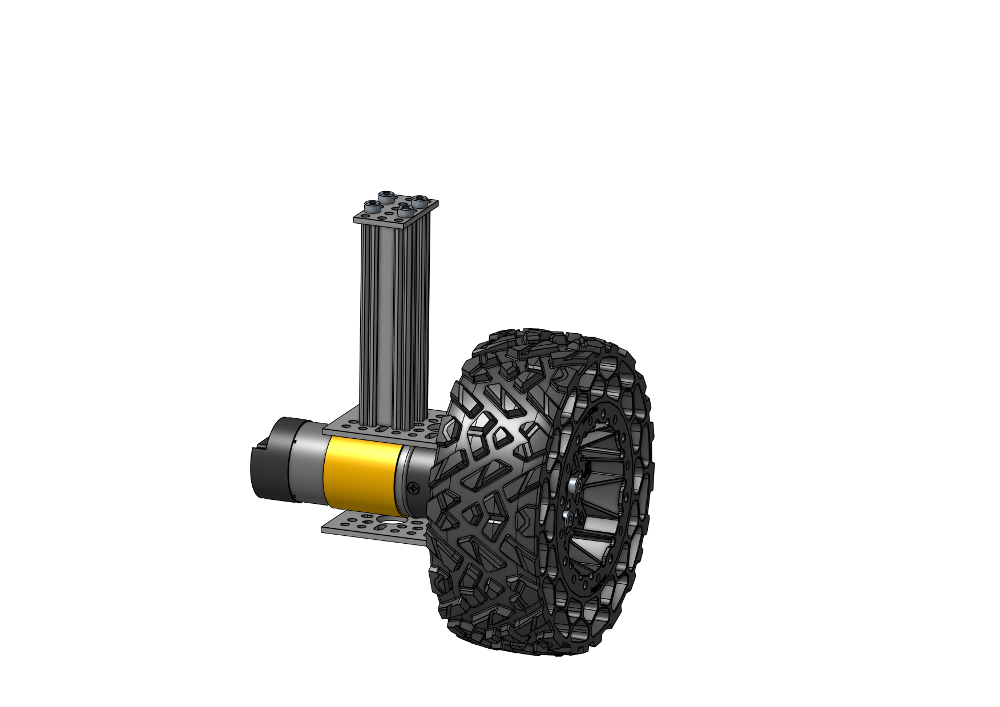

# Mechanical Assembly Guide

## 2 Wheels

#### Assembly Steps

- 2.1 [Corner Wheels (2L/2R)](#21-corner-wheels-2l2r)
- 2.2 [Middle Wheels (L/R)](#22-middle-wheels-lr)
- [Required Parts (Wheels)](#required-parts-wheels)

### 2.1 Corner Wheels (2L/2R)

#### Required Parts

| Amount | Part                                                                                                                             | Part Number    | Link                                                                                                                                  |
| :----: | -------------------------------------------------------------------------------------------------------------------------------- | -------------- | ------------------------------------------------------------------------------------------------------------------------------------- |
|   4    | Wasteland Wheel (**144mm Diameter**, **52mm Width**)                                                                             | 3616-0014-0144 | https://www.gobilda.com/wasteland-wheel-144mm-diameter-52mm-width/                                                                    |
|   4    | 5203 Series Yellow Jacket Planetary Gear Motor (26.9:1 Ratio, **24mm Length** **8mm REX™** Shaft, **223 RPM**, 3.3 - 5V Encoder) | 5203-2402-0027 | https://www.gobilda.com/5203-series-yellow-jacket-planetary-gear-motor-26-9-1-ratio-24mm-length-8mm-rex-shaft-223-rpm-3-3-5v-encoder/ |
|   4    | 1310 Series Hyper Hub (**8mm REX™** Bore)                                                                                        | 1310-0016-4008 | https://www.gobilda.com/1310-series-hyper-hub-8mm-rex-bore/                                                                           |
|   4    | 1401 Series 2-Side, 2-Post Clamping Mount (**43mm Width**, **36mm Bore**)                                                        | 1401-0043-0036 | https://www.gobilda.com/1401-series-2-side-2-post-clamping-mount-43mm-width-36mm-bore/                                                |
|   4    | 1120 Series U-Channel (**2 Hole**, 72mm Length)                                                                                  | 1120-0002-0072 | https://www.gobilda.com/1120-series-u-channel-2-hole-72mm-length/                                                                     |
|   4    | 1121 Series Low-Side U-Channel (**4 Hole**, 120mm Length)                                                                        | 1121-0004-0120 | https://www.gobilda.com/1121-series-low-side-u-channel-4-hole-120mm-length/                                                           |
|   4    | 1109 Series goRAIL (**144mm Length**)                                                                                            | 1109-0024-0144 | https://www.gobilda.com/1109-series-gorail-144mm-length/                                                                              |
|   16   | `M4 x 6mm` Button Head Screw                                                                                                     |                |
|   16   | `M4 x 10mm` Button Head Screw                                                                                                    |                |                                                                                                                                       |
|   32   | `M4 x 12mm` Socket Head Screw                                                                                                    |                |                                                                                                                                       |

#### Assembly Info

Screw the _144mm goRAIL_ to the _U-Channel_ first using 10mm button head screws. Install the _Clamping Mount_ with 6mm button head screws and the _Low-Side U-Channel_ with the 12mm socket head screws.

> ⚠️ Remember to feed the required cables through the _goRAIL_ before installing the motor.

Insert the motor into the _Clamping Mount_ so that the dark gray part of the motor lines up with the edge of the _U-Channel_. The _Hyper Hub_ should be flush with the end of the motor shaft Install the wheel using 12mm socket head screws. The deeper side of the wheel should face the _Hyper Hub_ and hide the whole front of the motor.

#### 2.1.1 Left Corner Wheel (2x)

 

#### 2.1.2 Right Corner Wheel (2x)

 

### 2.2 Middle Wheels (L/R)

#### Required Parts

| Amount | Part                                                                                                                             | Part Number    | Link                                                                                                                                  |
| :----: | -------------------------------------------------------------------------------------------------------------------------------- | -------------- | ------------------------------------------------------------------------------------------------------------------------------------- |
|   2    | Wasteland Wheel (**144mm Diameter**, **52mm Width**)                                                                             | 3616-0014-0144 | https://www.gobilda.com/wasteland-wheel-144mm-diameter-52mm-width/                                                                    |
|   2    | 5203 Series Yellow Jacket Planetary Gear Motor (26.9:1 Ratio, **24mm Length** **8mm REX™** Shaft, **223 RPM**, 3.3 - 5V Encoder) | 5203-2402-0027 | https://www.gobilda.com/5203-series-yellow-jacket-planetary-gear-motor-26-9-1-ratio-24mm-length-8mm-rex-shaft-223-rpm-3-3-5v-encoder/ |
|   2    | 1310 Series Hyper Hub (**8mm REX™** Bore)                                                                                        | 1310-0016-4008 | https://www.gobilda.com/1310-series-hyper-hub-8mm-rex-bore/                                                                           |
|   2    | 1401 Series 2-Side, 2-Post Clamping Mount (**43mm Width**, **36mm Bore**)                                                        | 1401-0043-0036 | https://www.gobilda.com/1401-series-2-side-2-post-clamping-mount-43mm-width-36mm-bore/                                                |
|   2    | 1120 Series U-Channel (**2 Hole**, 72mm Length)                                                                                  | 1120-0002-0072 | https://www.gobilda.com/1120-series-u-channel-2-hole-72mm-length/                                                                     |
|   2    | 1118 Series Open goRAIL (**96mm Length**)                                                                                        | 1118-0024-0096 | https://www.gobilda.com/1118-series-open-gorail-96mm-length/                                                                          |
|   2    | 1116 Series Grid Plate (**3 x 5 Hole**, 24 x 40mm)                                                                               | 1116-0024-0040 | https://www.gobilda.com/1116-series-grid-plate-3-x-5-hole-24-x-40mm/                                                                  |
|   8    | `M4 x 6mm` Button Head Screw                                                                                                     |                |
|   8    | `M4 x 10mm` Button Head Screw                                                                                                    |                |                                                                                                                                       |
|   16   | `M4 x 12mm` Socket Head Screw                                                                                                    |                |                                                                                                                                       |

#### Assembly Info

Screw the _96mm goRAIL_ to the _U-Channel_ first using 10mm button head screws.

> ⚠️ Make sure the open side of the _goRAIL_ points towards the back of the motor away from the wheel!

Install the _Clamping Mount_ with 6mm button head screws and the _Grid Plate_ with the 12mm socket head screws.

> ⚠️ Make sure to install the _3 x 5 Grid Plate_ in the correct orientation. It should be perpendicular to the motor.

Remember to feed the required cables through the _goRAIL_ before installing the motor. Insert the motor into the _Clamping Mount_ so that the dark gray part of the motor lines up with the edge of the _U-Channel_. The _Hyper Hub_ should be flush with the end of the motor shaft Install the wheel using 12mm socket head screws. The deeper side of the wheel should face the _Hyper Hub_ and hide the whole front of the motor.

#### 2.2.1 Left Middle Wheel

 

#### 2.2.2 Right Middle Wheel

 

### Next Steps

> 🎉 Congratulations on completing the wheel assembly!

- [x] [1 Main Body](1_main_body.md)
- [x] 2 Wheels
- [ ] [3 Rocker Bogie](3_rocker_bogie.md)
- [ ] [4 Final Steps](4_final_steps.md)

Continue with building the [Rocker Bogie](3_rocker_bogie.md)!

### Required Parts (Wheels)

This is a summary of all parts required in this chapter.

| Amount | Part                                                                                                                             | Part Number    | Link                                                                                                                                  |
| :----: | -------------------------------------------------------------------------------------------------------------------------------- | -------------- | ------------------------------------------------------------------------------------------------------------------------------------- |
|   4    | 1109 Series goRAIL (**144mm Length**)                                                                                            | 1109-0024-0144 | https://www.gobilda.com/1109-series-gorail-144mm-length/                                                                              |
|   2    | 1116 Series Grid Plate (**3 x 5 Hole**, 24 x 40mm)                                                                               | 1116-0024-0040 | https://www.gobilda.com/1116-series-grid-plate-3-x-5-hole-24-x-40mm/                                                                  |
|   2    | 1118 Series Open goRAIL (**96mm Length**)                                                                                        | 1118-0024-0096 | https://www.gobilda.com/1118-series-open-gorail-96mm-length/                                                                          |
|   6    | 1120 Series U-Channel (**2 Hole**, 72mm Length)                                                                                  | 1120-0002-0072 | https://www.gobilda.com/1120-series-u-channel-2-hole-72mm-length/                                                                     |
|   4    | 1121 Series Low-Side U-Channel (**4 Hole**, 120mm Length)                                                                        | 1121-0004-0120 | https://www.gobilda.com/1121-series-low-side-u-channel-4-hole-120mm-length/                                                           |
|   6    | 1310 Series Hyper Hub (**8mm REX™** Bore)                                                                                        | 1310-0016-4008 | https://www.gobilda.com/1310-series-hyper-hub-8mm-rex-bore/                                                                           |
|   6    | 1401 Series 2-Side, 2-Post Clamping Mount (**43mm Width**, **36mm Bore**)                                                        | 1401-0043-0036 | https://www.gobilda.com/1401-series-2-side-2-post-clamping-mount-43mm-width-36mm-bore/                                                |
|   6    | Wasteland Wheel (**144mm Diameter**, **52mm Width**)                                                                             | 3616-0014-0144 | https://www.gobilda.com/wasteland-wheel-144mm-diameter-52mm-width/                                                                    |
|   6    | 5203 Series Yellow Jacket Planetary Gear Motor (26.9:1 Ratio, **24mm Length** **8mm REX™** Shaft, **223 RPM**, 3.3 - 5V Encoder) | 5203-2402-0027 | https://www.gobilda.com/5203-series-yellow-jacket-planetary-gear-motor-26-9-1-ratio-24mm-length-8mm-rex-shaft-223-rpm-3-3-5v-encoder/ |
|   24   | `M4 x 6mm` Button Head Screw                                                                                                     |                |
|   24   | `M4 x 10mm` Button Head Screw                                                                                                    |                |                                                                                                                                       |
|   48   | `M4 x 12mm` Socket Head Screw                                                                                                    |                |                                                                                                                                       |
