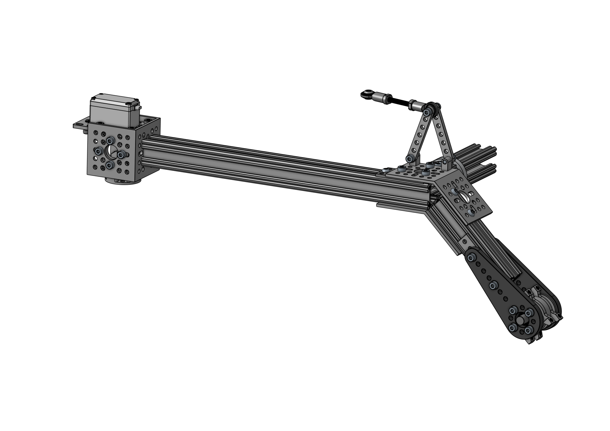
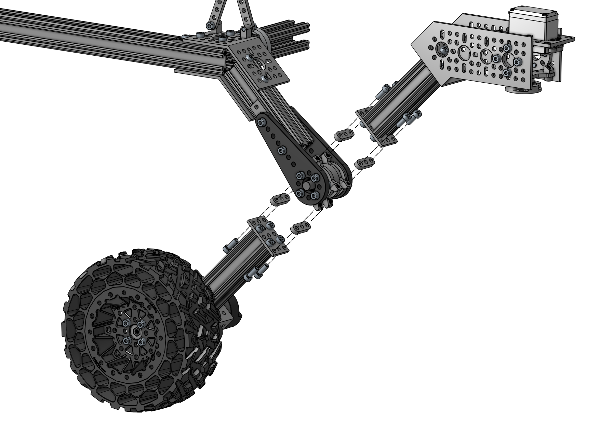

# Mechanical Assembly Guide

## 3 Rocker Bogie

#### Assembly Steps

- 3.1 [Hinge Outer Part (4x)](#31-hinge-outer-part-4x)
- 3.2 [Hinge Inner Part (2x)](#32-hinge-inner-part-2x)
- 3.3 [Hinge Assembly (2x)](#33-hinge-assembly-2x)
- 3.4 [Servo Block (4x)](#34-servo-block-4x)
- 3.5 [Rear Servo Arm (L/R)](#35-rear-servo-arm-lr)
- 3.6 [Front Servo Arm (L/R)](#36-front-servo-arm-lr)
- 3.7 [Pivot Plate (L/R)](#37-pivot-plate-lr)
- 3.8 [Top Plate (L/R)](#38-top-plate-lr)
- 3.9 [Rocker Bogie Rear Assembly (L/R)](#39-rocker-bogie-rear-assembly-lr)
- 3.10 [Rocker Bogie Front Assembly (L/R)](#310-rocker-bogie-front-assembly-lr)
- [Required Parts (Rocker Bogie)](#required-parts-rocker-bogie)

### 3.1 Hinge Outer Part (4x)

#### Required Parts

| Amount | Part                                                                                    | Part Number    | Link                                                                                            |
| :----: | --------------------------------------------------------------------------------------- | -------------- | ----------------------------------------------------------------------------------------------- |
|   4    | Plastic Hub-Mount Control Arm (**72mm Length**)                                         | 1916-0014-0072 | https://www.gobilda.com/plastic-hub-mount-control-arm-72mm-length/                              |
| 4 (2)  | 1114 Series Flat Bracket (**1-1**) - 2 Pack                                             | 1114-0001-0001 | https://www.gobilda.com/1114-series-flat-bracket-1-1-2-pack/                                    |
|   4    | 1504 Series **32mm OD** Pattern Spacer (**2mm Length**)                                 | 1504-0032-0020 | https://www.gobilda.com/1504-series-32mm-od-pattern-spacer-2mm-length/                          |
| 4 (2)  | 1611 Series Flanged Ball Bearing (**8mm ID** x **14mm OD**, **5mm Thickness**) - 2 Pack | 1611-0514-0008 | https://www.gobilda.com/1611-series-flanged-ball-bearing-8mm-id-x-14mm-od-5mm-thickness-2-pack/ |
|   8    | Hurricane Nut for goRAIL                                                                | 2805-0004-0108 |                                                                                                 |
|   16   | `M4 x 8mm` Socket Head Screw                                                            |                |                                                                                                 |
|   8    | `M4 x 12mm` Socket Head Screw                                                           |                |                                                                                                 |
|   24   | `M4 x 0.1mm` Washer                                                                     |                |                                                                                                 |

#### Assembly Info

⚠️ Use washers between screw heads and plastic parts!

Insert the _Flanged Ball Bearing_ into the _Pattern Spacer_. Screw the _Control Arm_ to the _Pattern Spacer_ with the _Flanged Ball Bearing_ facing the _Control Arm_ using 8mm socket head screws. Install the _Flat Bracket_ to holes `3` and `7` of the _Control Arm_ so that the first two holes of the _Control Arms_ are not covered by the _Flat Bracket_. Use 12mm socket head screws and _Hurricane Nuts_ for this. The _Flat Bracket_ will stick out a bit.

</img> </img>

### 3.2 Hinge Inner Part (2x)

#### Required Parts

| Amount | Part                                                         | Part Number    | Link                                                                         |
| :----: | ------------------------------------------------------------ | -------------- | ---------------------------------------------------------------------------- |
|   2    | 1309 Series Sonic Hub (**8mm Bore**)                         | 1309-0016-0008 | https://www.gobilda.com/1309-series-sonic-hub-8mm-bore/                      |
|   2    | **8mm** Shaft (Stainless Steel, **50mm Length**)             | 2100-0008-0050 | https://www.gobilda.com/8mm-shaft-stainless-steel-50mm-length/               |
|   4    | 1221 Series 2-Side, 2-Post Pattern Mount (**32-2**)          | 1221-0032-0002 | https://www.gobilda.com/1221-series-2-side-2-post-pattern-mount-32-2/        |
| 2 (1)  | 1522 Series 8mm ID Spacer (10mm OD, **6mm Length**) - 4 Pack | 1522-0010-0060 | https://www.gobilda.com/1522-series-8mm-id-spacer-10mm-od-6mm-length-4-pack/ |
| 2 (1)  | 1522 Series 8mm ID Spacer (10mm OD, **4mm Length**) - 4 Pack | 1522-0010-0040 | https://www.gobilda.com/1522-series-8mm-id-spacer-10mm-od-4mm-length-4-pack/ |
|   16   | `M4 x 6mm` Button Head Screw                                 |                |                                                                              |

#### Assembly Info

Insert the shaft into the _Sonic Hub_ and tighten the _Sonic Hub_ in the center of the shaft. Screw the _Pattern Mounts_ to each side of the _Sonic Hub_ using 6mm button head screws. The flat side of the _Pattern Mounts_ must face towards the _Sonic Hub_.

⚠️ Pay attention to the two different spacer lengths!

Slide the _4mm Spacer_ onto the shaft on the side where the _Sonic Hub_ is slightly further out and the _6mm Spacer_ on the side where the _Sonic Hub_ is flat.

</img> </img>

### 3.3 Hinge Assembly (2x)

#### Required Parts

| Amount | Part                                        | Part Number    | Link                                                         |
| :----: | ------------------------------------------- | -------------- | ------------------------------------------------------------ |
|   4    | [Hinge Outer Part](#31-hinge-outer-part-4x) |                |                                                              |
|   2    | [Hinge Inner Part](#32-hinge-inner-part-2x) |                |                                                              |
|   2    | 1118 Series Open goRAIL (**96mm Length**)   | 1118-0024-0096 | https://www.gobilda.com/1118-series-open-gorail-96mm-length/ |

#### Assembly Info

Slide one of the _Outer Parts_ onto either side of the _Inner Part_ with the _Hurricane Nuts_ facing inwards. Slide the _goRAIL_ into place until it is flush with the _Flat Bracket_ and tighten the screws.

⚠️ The open side of the _goRAIL_ must face towards one of the _Outer Parts_!

</img> </img>

### 3.4 Servo Block (4x)

#### Required Parts

| Amount | Part                                                    | Part Number    | Link                                                                        |
| :----: | ------------------------------------------------------- | -------------- | --------------------------------------------------------------------------- |
|   4    | ServoBlock® (Standard Size, 25 Tooth Spline, Hub-Shaft) | 3202-0001-2501 | https://www.gobilda.com/servoblock-standard-size-25-tooth-spline-hub-shaft/ |
|   4    | 2000 Series Dual Mode Servo (**25-2**, **Torque**)      | 2000-0025-0002 | https://www.gobilda.com/2000-series-dual-mode-servo-25-2-torque/            |

#### Assembly Info

💡 Insert the _Servo_ first. Assemble the rest of the _Servo Block_ loosely. Attach the shaft to the servo first before tightening all the screws.

⚠️ Secure the shaft to the servo with the included M3 screw that is included with the servo itself!

</img> </img>

### 3.5 Rear Servo Arm (L/R)

#### Required Parts

| Amount | Part                                            | Part Number    | Link                                                              |
| :----: | ----------------------------------------------- | -------------- | ----------------------------------------------------------------- |
|   2    | 1118 Series Open goRAIL (**288mm Length**)      | 1118-0024-0288 | https://www.gobilda.com/1118-series-open-gorail-288mm-length/     |
|   2    | 1120 Series U-Channel (**1 Hole**, 48mm Length) | 1120-0001-0048 | https://www.gobilda.com/1120-series-u-channel-1-hole-48mm-length/ |
|   2    | [Servo Block](#34-servo-block-4x)               |                |                                                                   |
|   16   | `M4 x 8mm` Socket Head Screw                    |                |                                                                   |
|   8    | `M4 x 12mm` Socket Head Screw                   |                |                                                                   |

#### Assembly Info

Screw the _U-Channel_ to the _goRAIL_ first using 12mm socket head screws, before installing the _Servo Block_ with 8mm socket head screws.

#### 3.5.1 Left Rear Servo Arm

⚠️ The open side of the _goRAIL_ faces to the right side when looking from the _Servo Block_ (away from the camera in the following image).

</img> </img>

#### 3.5.2 Right Rear Servo Arm

⚠️ The open side of the _goRAIL_ faces to the left side when looking from the _Servo Block_ (away from the camera in the following image).

</img> </img>

### 3.6 Front Servo Arm (L/R)

#### Required Parts

| Amount | Part                                               | Part Number    | Link                                                                 |
| :----: | -------------------------------------------------- | -------------- | -------------------------------------------------------------------- |
|   2    | 1118 Series Open goRAIL (**96mm Length**)          | 1118-0024-0096 | https://www.gobilda.com/1118-series-open-gorail-96mm-length/         |
|   2    | 1111 Series Angle Pattern Bracket (**3-1**)        | 1111-0003-0001 | https://www.gobilda.com/1111-series-angle-pattern-bracket-3-1/       |
|   2    | 1116 Series Grid Plate (**3 x 5 Hole**, 24 x 40mm) | 1116-0024-0040 | https://www.gobilda.com/1116-series-grid-plate-3-x-5-hole-24-x-40mm/ |
|   2    | [Servo Block](#34-servo-block-4x)                  |                |                                                                      |
|   16   | `M4 x 8mm` Socket Head Screw                       |                |                                                                      |
|   16   | `M4 x 12mm` Socket Head Screw                      |                |                                                                      |

#### Assembly Info

Screw the _U-Channel_ and _Grid Plate_ to the _goRAIL_ first using 12mm socket head screws.

⚠️ Make sure to install the _3 x 5 Grid Plate_ in the correct orientation. It should stick out at the top and bottom, not to the sides.

Install the _Servo Block_ with 8mm socket head screws. The cable should point towards the _goRAIL_. The _Servo Block_ is supposed to stick out of the _U-Channel_.

#### 3.6.1 Left Front Servo Arm

⚠️ The open side of the _goRAIL_ faces to the left, when looking from the _Servo Block_ (away from the camera in the following image).

</img> </img>

#### 3.6.2 Right Front Servo Arm

⚠️ The open side of the _goRAIL_ faces to the right, when looking from the _Servo Block_ (away from the camera in the following image).

</img> </img>

### 3.7 Pivot Plate (L/R)

#### Required Parts

| Amount | Part                                                                            | Part Number    | Link                                                                                            |
| :----: | ------------------------------------------------------------------------------- | -------------- | ----------------------------------------------------------------------------------------------- |
|   2    | 1111 Series Angle Pattern Bracket (**1-1**)                                     | 1111-0001-0001 | https://www.gobilda.com/1111-series-angle-pattern-bracket-1-1/                                  |
| 4 (1)  | 1203 Series Block Mount (1-1) - 4 Pack                                          | 1203-0001-0001 | https://www.gobilda.com/1203-series-block-mount-1-1-4-pack/                                     |
| 4 (2)  | 1102 Series Flat Beam (**7 Hole**, 56mm Length) - 2 Pack                        | 1102-0007-0056 | https://www.gobilda.com/1102-series-flat-beam-7-hole-56mm-length-2-pack/                        |
| 4 (2)  | 2913 Series Steel Ball Linkage (**Female** M4 x 0.7mm, 24.1mm Length) - 2 Pack  | 2913-0004-0241 | https://www.gobilda.com/2913-series-steel-ball-linkage-female-m4-x-0-7mm-24-1mm-length-2-pack/  |
| 2 (1)  | 2808 Series Stainless Steel Threaded Rod (M4 x 0.7mm, **50mm Length**) - 2 Pack | 2808-0004-0050 | https://www.gobilda.com/2808-series-stainless-steel-threaded-rod-m4-x-0-7mm-50mm-length-2-pack/ |
|   4    | `M4 x 8mm` Socket Head Screw                                                    |                |                                                                                                 |
|   4    | `M4 x 12mm` Socket Head Screw                                                   |                |                                                                                                 |
|   2    | `M4 x 20mm` Socket Head Screw                                                   |                |                                                                                                 |
|   2    | `M4` Nylock Nut                                                                 |                |                                                                                                 |

#### Assembly Info

Install the _Block Mounts_ using 8mm socket head screws with the chamfered edge facing the edge of the _Angle Pattern Bracket_. Do not tighten the screws completely. Use 12mm socket head screws to loosely attach one _Flat Beam_ to each _Block Mount_ on opposite sides. Screw _Steel Ball Linkages_ to both ends of the _Threaded Rod_ until they are about 26mm apart and one is turned 90 degrees. Slide the _Steel Ball Linkage_ between the two _Flat Beams_ and secure it using a 20mm socket head screw and a Nylock nut. Tighten all screws now.

⚠️ When all screws are tightened, the _Block Mounts_ will be at a slight angle. This is expected behavior.

#### 3.7.1 Left Pivot Plate

</img> </img>

#### 2.7.2 Right Pivot Plate

</img> </img>

### 3.8 Top Plate (L/R)

#### Required Parts

| Amount | Part                                               | Part Number    | Link                                                                    |
| :----: | -------------------------------------------------- | -------------- | ----------------------------------------------------------------------- |
|   2    | [Pivot Plate (L/R)](#37-pivot-plate-lr)            |                |                                                                         |
| 2 (1)  | 1137 Series Steel Flat Grid Bracket (1-1) - 2 Pack | 1137-0001-0001 | https://www.gobilda.com/1137-series-steel-flat-grid-bracket-1-1-2-pack/ |
|   16   | Hurricane Nut for goRAIL                           | 2805-0004-0108 |                                                                         |
|   10   | `M4 x 6mm` Button Head Screw                       |                |                                                                         |
|   6    | `M4 x 8mm` Socket Head Screw                       |                |                                                                         |

#### Assembly Info

Insert three 6mm button head screws into the ends of the _Grid Bracket_ as shown in the pictures. Loosely fit _Hurricane Nuts_ on the other side. Attach the _Grid Bracket_ to the underside of the _Angle Pattern Bracket_ so that the button head screws and half a hole protrude. Secure it in place with three 8mm socket head screws and slightly loose _Hurricane Nuts_ as seen in the pictures. Add two 6mm screws and _Hurricane Nuts_ to the angled side of the _Angle Pattern Bracket_.

⚠️ The _Hurricane Nuts_ should form two perpendicular lines. One line of five across the fold and a line of three parallel to the fold between the _Flat Brackets_.

#### 3.8.1 Left Top Plate

</img> </img>

#### 3.8.2 Right Top Plate

</img> </img>

### 3.9 Rocker Bogie Rear Assembly (L/R)

#### Required Parts

| Amount | Part                                                          | Part Number    | Link                                                                          |
| :----: | ------------------------------------------------------------- | -------------- | ----------------------------------------------------------------------------- |
|   2    | [Top Plate (L/R)](#37-pivot-plate-lr)                         |                |                                                                               |
|   2    | [Rear Servo Arm (L/R)](#35-rear-servo-arm-lr)                 |                |                                                                               |
|   2    | [Hinge Assembly](#33-hinge-assembly-2x)                       |                |                                                                               |
|   2    | 1111 Series Angle Pattern Bracket (**1-1**)                   | 1111-0001-0001 | https://www.gobilda.com/1111-series-angle-pattern-bracket-1-1/                |
|   2    | 1118 Series Open goRAIL (**120mm Length**)                    | 1118-0024-0120 | https://www.gobilda.com/1118-series-open-gorail-120mm-length/                 |
| 4 (2)  | 1506 Series 32mm ID Spacer (36mm OD, **6mm Length**) - 2 Pack | 1506-0032-0006 | https://www.gobilda.com/1506-series-32mm-id-spacer-36mm-od-6mm-length-2-pack/ |
|   8    | Hurricane Nut for goRAIL                                      | 2805-0004-0108 |                                                                               |
|   8    | `M4 x 6mm` Button Head Screw                                  |                |                                                                               |

#### Assembly Info

Insert four 6mm button head screws into the new _Angle Pattern Bracket_ in the same holes as the _Top Plate_ assembly and loosely secure them with _Hurricane Nuts_.

⚠️ The open side of the _goRAILs_ in the _Hinge Assembly_ and _Rear Servo Arms_ should face towards the center of the _Anlge Pattern Bracket_ and the _Steel Ball Bearing_!

Slide the _Rear Servo Arm_ onto the new _Angle Pattern Bracket_ up to the fold and tighten the screws. Slide the _Top Plate_ into the _Rear Servo Arm_ as well, but leave it loose for now. Insert the _Hinge Assembly_ into both _Angle Pattern Brackets_ up to the fold of the bottom one. Tighten the bottom screws. Now insert the _120mm goRAIL_ between the _Angle Pattern Brackets_ below the pivot point up to the _Rear Servo Arm_.

⚠️ The open side of the _120mm goRAIL_ should face sideways towards the _Hinge Assembly_!

Once all _goRAILs_ are in place, tighten all remaining screws and slide two spacer rings onto the _120mm goRAIL_.

#### 3.9.1 Left Rear Assembly

</img> </img>

#### 3.9.2 Right Rear Assembly

</img> </img>

### 3.10 Rocker Bogie Front Assembly (L/R)

#### Required Parts

| Amount | Part                                                     | Part Number    | Link                                                                     |
| :----: | -------------------------------------------------------- | -------------- | ------------------------------------------------------------------------ |
|   2    | [Front Servo Arm (L/R)](#36-front-servo-arm-lr)          |                |                                                                          |
|   2    | [Middle Wheel (L/R)](2_wheels.md#22-middle-wheels-lr)    |                |                                                                          |
| 8 (4)  | 1102 Series Flat Beam (**3 Hole**, 24mm Length) - 2 Pack | 1102-0003-0024 | https://www.gobilda.com/1102-series-flat-beam-3-hole-24mm-length-2-pack/ |
|   16   | `M4 x 12mm` Socket Head Screw                            |                |                                                                          |

#### Assembly Info

Attach the _Front Servo Arm_ and _Middle Wheel_ to the hinge using 12mm socket head screws and _Flat Beams_ as spacers in between.

⚠️ Make sure the open sides of all _goRAILs_ face the same direction, where the main body is going.

#### 3.10.1 Left Front Assembly

</img> </img>

#### 3.10.2 Right Front Assembly

</img> </img>

### Next Steps

🎉 Congratulations on completing the rocker bogie assembly!

- [x] [~~1 Main Body~~](1_main_body.md)
- [x] [~~2 Wheels~~](2_wheels.md)
- [x] [~~3 Rocker Bogie~~](3_rocker_bogie.md)
- [ ] [4 Final Steps](4_final_steps.md)

Continue with the [`Final Steps`](4_final_steps.md) to put it all together!

### Required Parts (Rocker Bogie)

This is a summary of all parts required in this chapter.

| Amount | Part                                                                                    | Part Number    | Link                                                                                            |
| :----: | --------------------------------------------------------------------------------------- | -------------- | ----------------------------------------------------------------------------------------------- |
| 8 (4)  | 1102 Series Flat Beam (**3 Hole**, 24mm Length) - 2 Pack                                | 1102-0003-0024 | https://www.gobilda.com/1102-series-flat-beam-3-hole-24mm-length-2-pack/                        |
| 4 (2)  | 1102 Series Flat Beam (**7 Hole**, 56mm Length) - 2 Pack                                | 1102-0007-0056 | https://www.gobilda.com/1102-series-flat-beam-7-hole-56mm-length-2-pack/                        |
|   4    | 1111 Series Angle Pattern Bracket (**1-1**)                                             | 1111-0001-0001 | https://www.gobilda.com/1111-series-angle-pattern-bracket-1-1/                                  |
|   2    | 1111 Series Angle Pattern Bracket (**3-1**)                                             | 1111-0003-0001 | https://www.gobilda.com/1111-series-angle-pattern-bracket-3-1/                                  |
| 4 (2)  | 1114 Series Flat Bracket (**1-1**) - 2 Pack                                             | 1114-0001-0001 | https://www.gobilda.com/1114-series-flat-bracket-1-1-2-pack/                                    |
|   2    | 1116 Series Grid Plate (**3 x 5 Hole**, 24 x 40mm)                                      | 1116-0024-0040 | https://www.gobilda.com/1116-series-grid-plate-3-x-5-hole-24-x-40mm/                            |
|   4    | 1118 Series Open goRAIL (**96mm Length**)                                               | 1118-0024-0096 | https://www.gobilda.com/1118-series-open-gorail-96mm-length/                                    |
|   2    | 1118 Series Open goRAIL (**288mm Length**)                                              | 1118-0024-0288 | https://www.gobilda.com/1118-series-open-gorail-288mm-length/                                   |
|   2    | 1118 Series Open goRAIL (**120mm Length**)                                              | 1118-0024-0120 | https://www.gobilda.com/1118-series-open-gorail-120mm-length/                                   |
|   2    | 1120 Series U-Channel (**1 Hole**, 48mm Length)                                         | 1120-0001-0048 | https://www.gobilda.com/1120-series-u-channel-1-hole-48mm-length/                               |
| 2 (1)  | 1137 Series Steel Flat Grid Bracket (1-1) - 2 Pack                                      | 1137-0001-0001 | https://www.gobilda.com/1137-series-steel-flat-grid-bracket-1-1-2-pack/                         |
| 4 (1)  | 1203 Series Block Mount (1-1) - 4 Pack                                                  | 1203-0001-0001 | https://www.gobilda.com/1203-series-block-mount-1-1-4-pack/                                     |
|   4    | 1221 Series 2-Side, 2-Post Pattern Mount (**32-2**)                                     | 1221-0032-0002 | https://www.gobilda.com/1221-series-2-side-2-post-pattern-mount-32-2/                           |
|   2    | 1309 Series Sonic Hub (**8mm Bore**)                                                    | 1309-0016-0008 | https://www.gobilda.com/1309-series-sonic-hub-8mm-bore/                                         |
|   4    | 1504 Series **32mm OD** Pattern Spacer (**2mm Length**)                                 | 1504-0032-0020 | https://www.gobilda.com/1504-series-32mm-od-pattern-spacer-2mm-length/                          |
| 4 (2)  | 1506 Series 32mm ID Spacer (36mm OD, **6mm Length**) - 2 Pack                           | 1506-0032-0006 | https://www.gobilda.com/1506-series-32mm-id-spacer-36mm-od-6mm-length-2-pack/                   |
| 2 (1)  | 1522 Series 8mm ID Spacer (10mm OD, **4mm Length**) - 4 Pack                            | 1522-0010-0040 | https://www.gobilda.com/1522-series-8mm-id-spacer-10mm-od-4mm-length-4-pack/                    |
| 2 (1)  | 1522 Series 8mm ID Spacer (10mm OD, **6mm Length**) - 4 Pack                            | 1522-0010-0060 | https://www.gobilda.com/1522-series-8mm-id-spacer-10mm-od-6mm-length-4-pack/                    |
| 4 (2)  | 1611 Series Flanged Ball Bearing (**8mm ID** x **14mm OD**, **5mm Thickness**) - 2 Pack | 1611-0514-0008 | https://www.gobilda.com/1611-series-flanged-ball-bearing-8mm-id-x-14mm-od-5mm-thickness-2-pack/ |
|   4    | Plastic Hub-Mount Control Arm (**72mm Length**)                                         | 1916-0014-0072 | https://www.gobilda.com/plastic-hub-mount-control-arm-72mm-length/                              |
|   4    | 2000 Series Dual Mode Servo (**25-2**, **Torque**)                                      | 2000-0025-0002 | https://www.gobilda.com/2000-series-dual-mode-servo-25-2-torque/                                |
|   2    | **8mm** Shaft (Stainless Steel, **50mm Length**)                                        | 2100-0008-0050 | https://www.gobilda.com/8mm-shaft-stainless-steel-50mm-length/                                  |
| 32 (2) | Hurricane Nut for goRAIL - 25 Pack                                                      | 2805-0004-0108 | https://www.gobilda.com/hurricane-nut-for-gorail-25-pack/                                       |
| 2 (1)  | 2808 Series Stainless Steel Threaded Rod (M4 x 0.7mm, **50mm Length**) - 2 Pack         | 2808-0004-0050 | https://www.gobilda.com/2808-series-stainless-steel-threaded-rod-m4-x-0-7mm-50mm-length-2-pack/ |
| 4 (2)  | 2913 Series Steel Ball Linkage (**Female** M4 x 0.7mm, 24.1mm Length) - 2 Pack          | 2913-0004-0241 | https://www.gobilda.com/2913-series-steel-ball-linkage-female-m4-x-0-7mm-24-1mm-length-2-pack/  |
|   4    | ServoBlock® (Standard Size, 25 Tooth Spline, Hub-Shaft)                                 | 3202-0001-2501 | https://www.gobilda.com/servoblock-standard-size-25-tooth-spline-hub-shaft/                     |
|   34   | `M4 x 6mm` Button Head Screw                                                            |                |                                                                                                 |
|   58   | `M4 x 8mm` Socket Head Screw                                                            |                |                                                                                                 |
|   52   | `M4 x 12mm` Socket Head Screw                                                           |                |                                                                                                 |
|   2    | `M4 x 20mm` Socket Head Screw                                                           |                |                                                                                                 |
|   2    | `M4` Nylock Nut                                                                         |                |                                                                                                 |
|   24   | `M4 x 0.1mm` Washer                                                                     |                |                                                                                                 |
