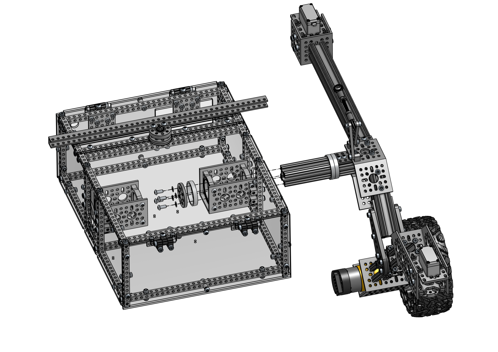
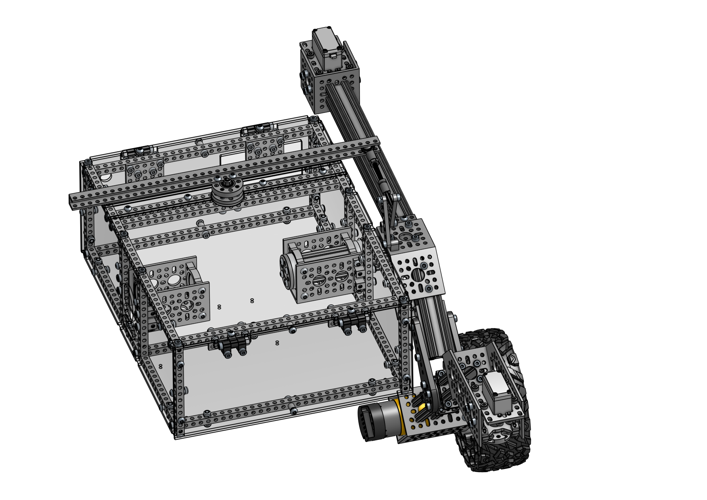
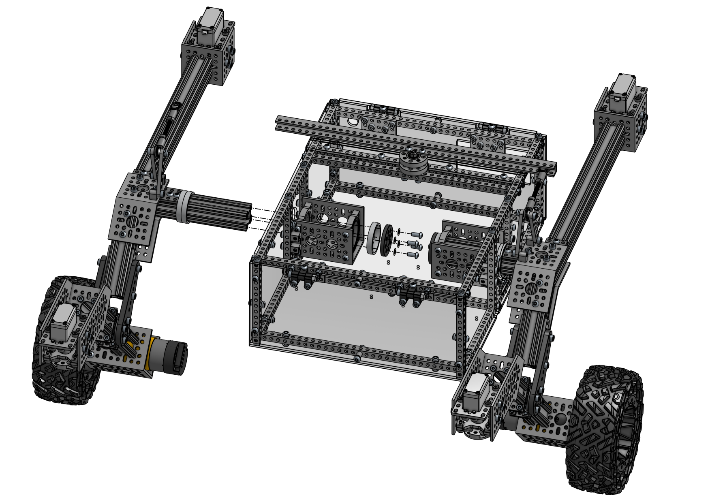
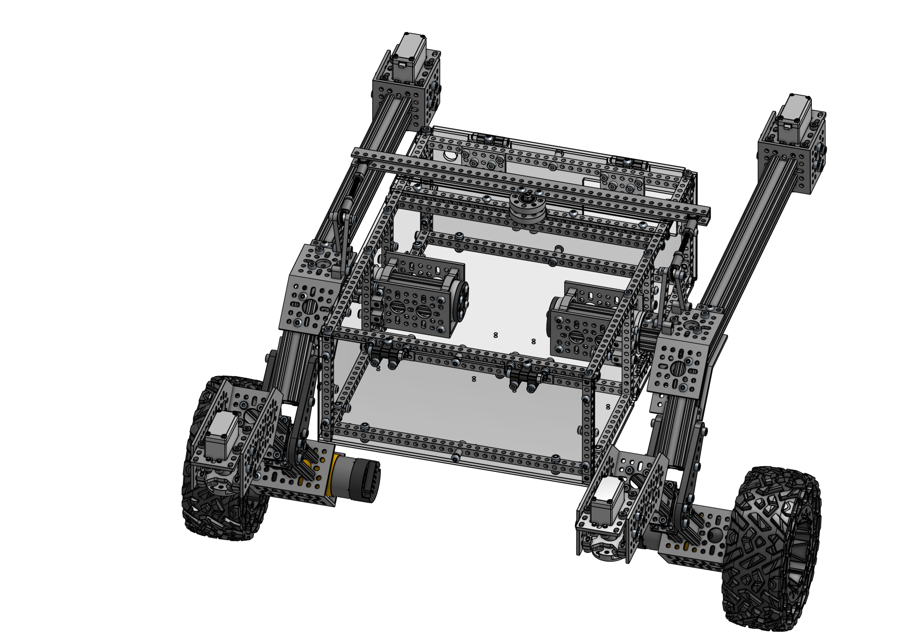
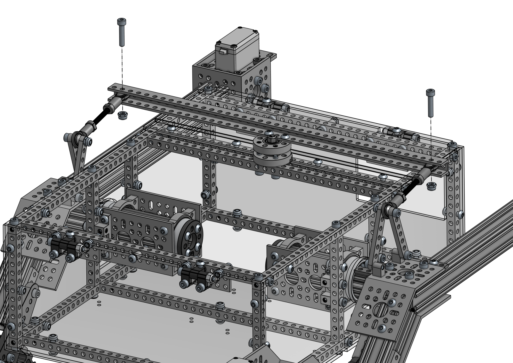
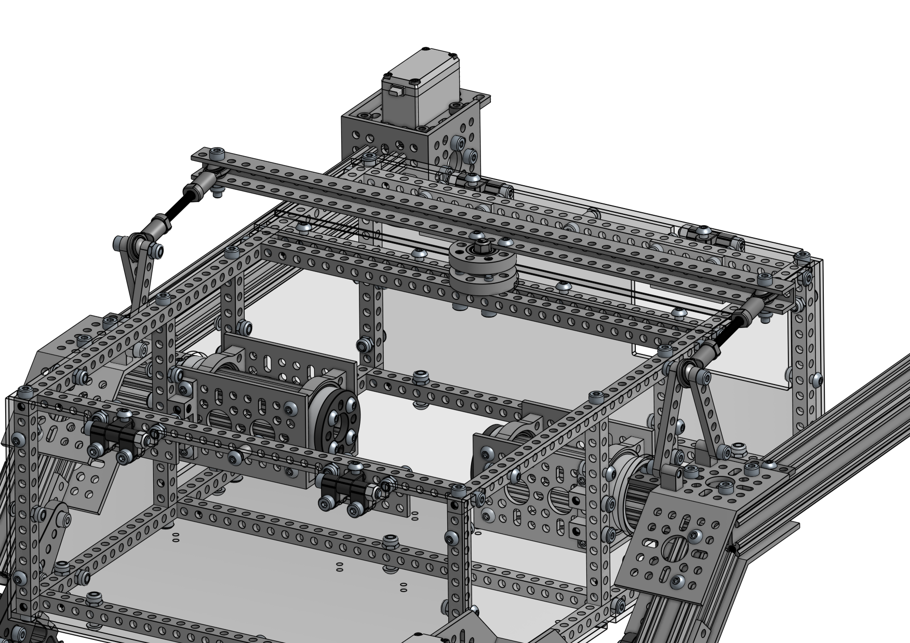
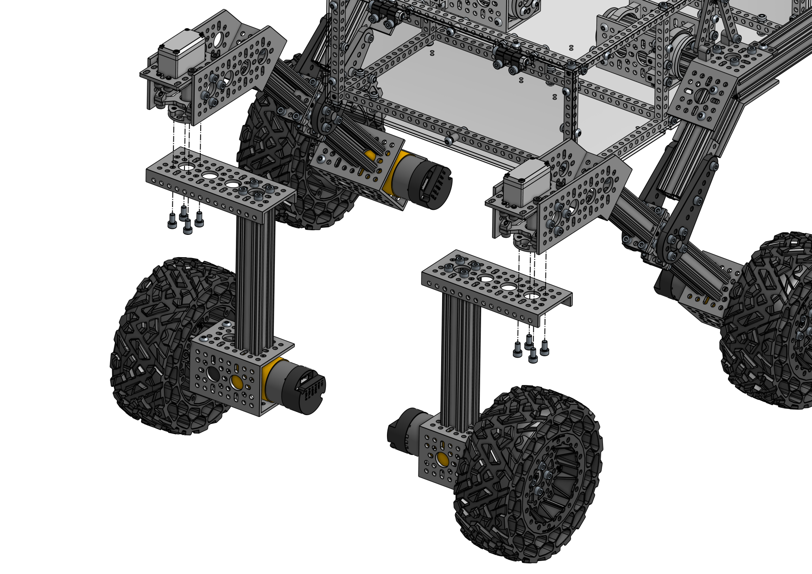
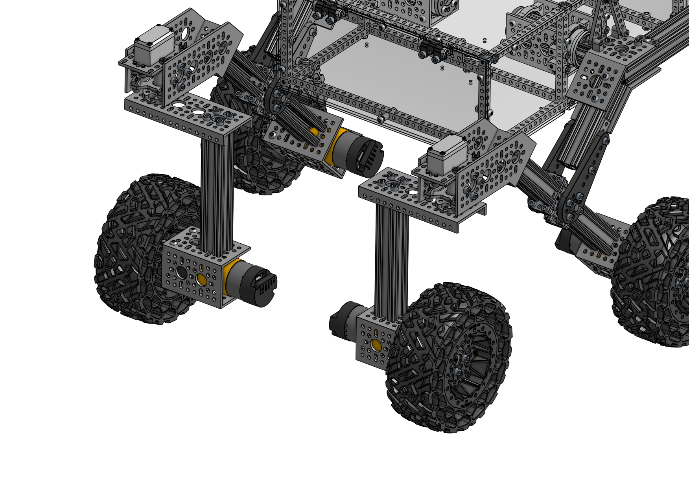
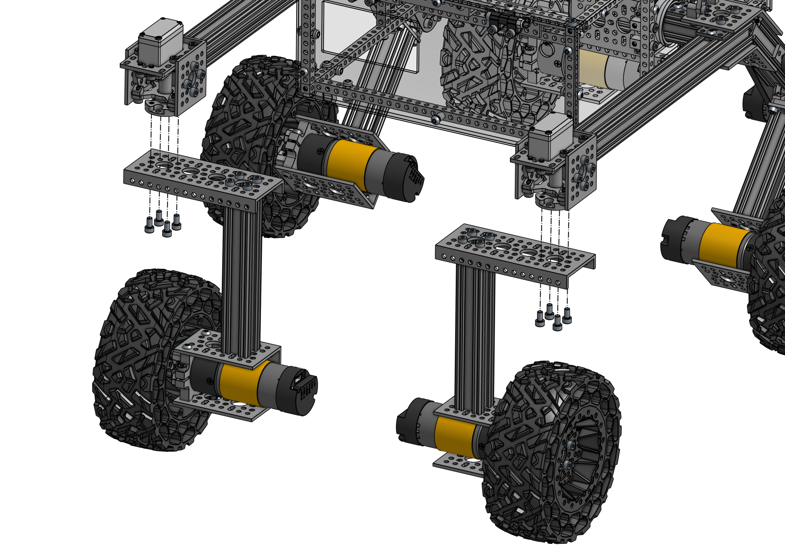
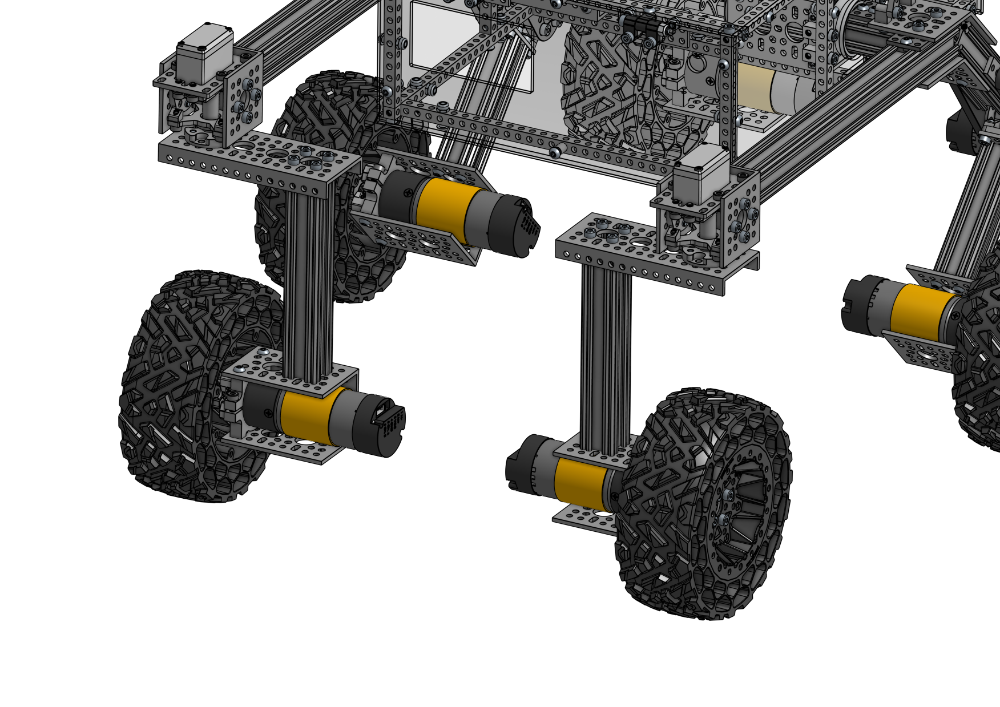

# Mechanical Assembly Guide

## 4 Final Steps

#### Assembly Steps

- 4.1 [Rocker Bogie Insertion](#41-rocker-bogie-insertion)
- 4.2 [Differential Pivot Attachment](#42-differential-pivot-attachment)
- 4.3 [Front Wheels](#43-front-wheels)
- 4.4 [Rear Wheels](#44-rear-wheels)
- [Required Parts (Final Steps)](#required-parts-final-steps)

### 4.1 Rocker Bogie Insertion

#### Required Parts

| Amount | Part                                                          | Part Number    | Link                                                                          |
| :----: | ------------------------------------------------------------- | -------------- | ----------------------------------------------------------------------------- |
|   1    | [Main Body](1_main_body.md)                                   |                |                                                                               |
|   2    | [Rocker Bogie (L/R)](3_rocker_bogie.md)                       |                |                                                                               |
| 2 (1)  | 1506 Series 32mm ID Spacer (36mm OD, **6mm Length**) - 2 Pack | 1506-0032-0006 | https://www.gobilda.com/1506-series-32mm-id-spacer-36mm-od-6mm-length-2-pack/ |
| 2 (1)  | goTUBE Endcap (14mm Bore, 36mm OD, 4mm Thick) - 4 Pack        | 1519-0014-0400 | https://www.gobilda.com/gotube-endcap-14mm-bore-36mm-od-4mm-thick-4-pack/     |
|   8    | `M4 x 10mm` Button Head Screw                                 |                |                                                                               |
|   8    | `M4 x 0.1mm` Washer                                           |                |                                                                               |

#### Assembly Info

Insert the _Rocker Bogie_ into the _Main Body_, slide another spacer ring onto the end of the _goRAIL_ and screw the _goTUBE Endcap_ onto it using four 10mm button head screws.

⚠️ Use washers between screw heads and plastic parts!

#### 4.1.1 Insert Left Rocker Bogie

</img> </img>

#### 4.1.2 Insert Right Rocker Bogie

</img> </img>

### 4.2 Differential Pivot Attachment

#### Required Parts

| Amount | Part                          | Part Number | Link |
| :----: | ----------------------------- | ----------- | ---- |
|   2    | `M4 x 20mm` Socket Head Screw |             |      |
|   2    | `M4` Nylock Nut               |             |      |

#### Assembly Info

Insert the loose _Steel Ball Bearings_ of the _Rocker Bogies_ into the _U-Channel_ on top of the _Main Body_. Secure them in hole `2` (counting from each end) with a 20mm socket head screw and Nylock nut.

</img> </img>

### 4.3 Front Wheels

#### Required Parts

| Amount | Part                                                    | Part Number | Link |
| :----: | ------------------------------------------------------- | ----------- | ---- |
|   2    | [Corner Wheel (L/R)](2_wheels.md#21-corner-wheels-2l2r) |             |      |
|   8    | `M4 x 8mm` Socket Head Screw                            |             |      |

#### Assembly Info

> ⚠️ **You need to center the servos before installing the wheels!**  
> Upload the provided [servo_centering.ino](../arduino_servo_centering/arduino_servo_centering.ino) sketch to an Arduino compatible device.
> Connect the red wire (VCC) of the servo to the 5V pin on the Arduino.
> Connect the black wire (GND) of the servo to one of the GND pins on the Arduino.
> Connect the white wire (signal) of the servo to pin 9 on the Arduino.

Once the servo is centered, one of the non-threaded holes of the servo shaft should point _exactly_ to the front of the rover. If necessary, remove the servo shaft and reinstall it in the correct orientation. Attach the _Corner Wheels_ to the servo shafts using four 12mm socket head screws.

</img> </img>

### 4.4 Rear Wheels

#### Required Parts

| Amount | Part                                                    | Part Number | Link |
| :----: | ------------------------------------------------------- | ----------- | ---- |
|   2    | [Corner Wheel (L/R)](2_wheels.md#21-corner-wheels-2l2r) |             |      |
|   8    | `M4 x 8mm` Socket Head Screw                            |             |      |

#### Assembly Info

> ⚠️ **You need to center the servos before installing the wheels!**  
> Upload the provided [servo_centering.ino](../arduino_servo_centering/arduino_servo_centering.ino) sketch to an Arduino compatible device.
> Connect the red wire (VCC) of the servo to the 5V pin on the Arduino.
> Connect the black wire (GND) of the servo to one of the GND pins on the Arduino.
> Connect the white wire (signal) of the servo to pin 9 on the Arduino.

Once the servo is centered, one of the non-threaded holes of the servo shaft should point _exactly_ to the back of the rover. If necessary, remove the servo shaft and reinstall it in the correct orientation. Attach the _Corner Wheels_ to the servo shafts using four 12mm socket head screws.

</img> </img>

### Next Steps

🎉 Congratulations on building your own little mars rover! 🎉

- [x] [~~1 Main Body~~](1_main_body.md)
- [x] [~~2 Wheels~~](2_wheels.md)
- [x] [~~3 Rocker Bogie~~](2_wheels.md)
- [x] [~~4 Final Steps~~](4_final_steps.md)

Continue with the electrical guides to bring your rover to life!

### Required Parts (Final Steps)

This is a summary of all parts required in this chapter.

| Amount | Part                                                          | Part Number    | Link                                                                          |
| :----: | ------------------------------------------------------------- | -------------- | ----------------------------------------------------------------------------- |
| 2 (1)  | 1506 Series 32mm ID Spacer (36mm OD, **6mm Length**) - 2 Pack | 1506-0032-0006 | https://www.gobilda.com/1506-series-32mm-id-spacer-36mm-od-6mm-length-2-pack/ |
| 2 (1)  | goTUBE Endcap (14mm Bore, 36mm OD, 4mm Thick) - 4 Pack        | 1519-0014-0400 | https://www.gobilda.com/gotube-endcap-14mm-bore-36mm-od-4mm-thick-4-pack/     |
|   8    | `M4 x 10mm` Button Head Screw                                 |                |                                                                               |
|   16   | `M4 x 8mm` Socket Head Screw                                  |                |                                                                               |
|   2    | `M4 x 20mm` Socket Head Screw                                 |                |                                                                               |
|   2    | `M4` Nylock Nut                                               |                |                                                                               |
|   8    | `M4 x 0.1mm` Washer                                           |                |                                                                               |
