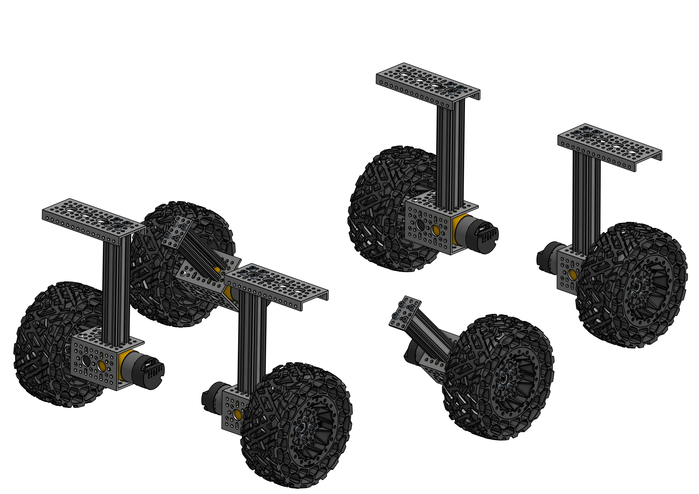

# Assembly Guide

</img>
</img>
</img>
</img>

This guide covers all the mechanical steps to build your own little mars rover. The assembly is divided into four chapters to give you a better overview of what needs to be done. Each chapter consists of several assembly steps, each with its own parts list and assembly instructions. You can follow this guide step by step and have your parts ready when you need them.

1. [Main Body `👈 Start here`](1_main_body.md#1-main-body)
   - 1.1 [Aluminum Frame](1_main_body.md#11-aluminum-frame)
   - 1.2 [Wall Standoffs](1_main_body.md#12-wall-standoffs)
   - 1.3 [Axis Clamps (2x)](1_main_body.md#13-axis-clamps-2x)
   - 1.4 [Axis Clamp Installation](1_main_body.md#14-axis-clamp-installation)
   - 1.5 [Top Plate Hinges (4x)](1_main_body.md#15-top-plate-hinges-4x)
   - 1.6 [Top Plate Hinge Installation](1_main_body.md#16-top-plate-hinge-installation)
   - 1.7 [Bottom Plate](1_main_body.md#17-bottom-plate)
   - 1.8 [Side Plates](1_main_body.md#18-side-plates)
   - 1.9 [Front and Back Plates](1_main_body.md#19-front-and-back-plates)
   - 1.10 [Top Plates](1_main_body.md#110-top-plates)
   - 1.11 [Differential Pivot](1_main_body.md#111-differential-pivot)
2. [Wheels](2_wheels.md#2-wheels)
   - 2.1 [Corner Wheels (2L/2R)](2_wheels.md#21-corner-wheels-2l2r)
   - 2.2 [Middle Wheels (L/R)](2_wheels.md#22-middle-wheels-lr)
3. [Rocker Bogie](3_rocker_bogie.md#3-rocker-bogie)
   - 3.1 [Hinge Outer Part (4x)](3_rocker_bogie.md#31-hinge-outer-part-4x)
   - 3.2 [Hinge Inner Part (2x)](3_rocker_bogie.md#32-hinge-inner-part-2x)
   - 3.3 [Hinge Assembly (2x)](3_rocker_bogie.md#33-hinge-assembly-2x)
   - 3.4 [Servo Block (4x)](3_rocker_bogie.md#34-servo-block-4x)
   - 3.5 [Rear Servo Arm (L/R)](3_rocker_bogie.md#35-rear-servo-arm-lr)
   - 3.6 [Front Servo Arm (L/R)](3_rocker_bogie.md#36-front-servo-arm-lr)
   - 3.7 [Pivot Plate (L/R)](3_rocker_bogie.md#37-pivot-plate-lr)
   - 3.8 [Top Plate (L/R)](3_rocker_bogie.md#38-top-plate-lr)
   - 3.9 [Rocker Bogie Rear Assembly (L/R)](3_rocker_bogie.md#39-rocker-bogie-rear-assembly-lr)
   - 3.10 [Rocker Bogie Front Assembly (L/R)](3_rocker_bogie.md#310-rocker-bogie-front-assembly-lr)
4. [Final Steps](4_final_steps.md#4-final-steps)
   - 4.1 [Rocker Bogie Insertion](4_final_steps.md#41-rocker-bogie-insertion)
   - 4.2 [Differential Pivot Attachment](4_final_steps.md#42-differential-pivot-attachment)
   - 4.3 [Front Wheels](4_final_steps.md#43-front-wheels)
   - 4.4 [Rear Wheels](4_final_steps.md#44-rear-wheels)

Further information on wiring and the inner components of the rover can be found in the electrical guides.
